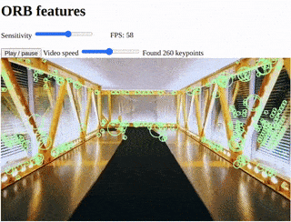

# speedy-vision.js

A **lightning fast** GPU-accelerated Computer Vision library for the web, with a focus on real-time feature detection and matching. ORB, FAST, BRISK, Harris, image processing and more!

[](https://alemart.github.io/speedy-vision-js/demos/orb-features.html)

*Click to open a demo*

## Table of contents

* [Demos](#demos)
* [Installation](#installation)
* [Motivation](#motivation)
* [API Reference](#api-reference)
  * [Media routines](#media-routines)
  * [Feature detection](#feature-detection)
  * [Feature matching](#feature-matching)
  * [Image processing](#image-processing)
  * [Extras](#extras)
* [Unit tests](https://alemart.github.io/speedy-vision-js/tests/index.html)

## Demos

Try the demos and take a look at their source code:

* [Hello, world!](https://alemart.github.io/speedy-vision-js/demos/hello-world.html)
* Feature detection
  * [Feature detection in a webcam](https://alemart.github.io/speedy-vision-js/demos/webcam-demo.html)
  * [Feature detection in an image](https://alemart.github.io/speedy-vision-js/demos/image-features.html)
  * [Feature detection in a video](https://alemart.github.io/speedy-vision-js/demos/video-features.html)
  * [Find the best Harris corners](https://alemart.github.io/speedy-vision-js/demos/best-features.html)
  * [Automatic sensitivity](https://alemart.github.io/speedy-vision-js/demos/automatic-sensitivity.html)
  * [ORB features](https://alemart.github.io/speedy-vision-js/demos/orb-features.html)
* Image processing
  * [Nightvision camera](https://alemart.github.io/speedy-vision-js/demos/nightvision-camera.html)
  * [Cool effects with image convolutions](https://alemart.github.io/speedy-vision-js/demos/convolution.html)
  * [Convert image to greyscale](https://alemart.github.io/speedy-vision-js/demos/greyscale-image.html)
  * [Convert video to greyscale](https://alemart.github.io/speedy-vision-js/demos/greyscale-video.html)
  * [Blurring an image](https://alemart.github.io/speedy-vision-js/demos/image-blurring.html)
  * [Normalize camera stream](https://alemart.github.io/speedy-vision-js/demos/normalize-demo.html)

## Installation

Download the latest release of speedy-vision.js and include it in the `<head>` section of your HTML page:

```html
<script src="dist/speedy-vision.min.js"></script>
```

Once you import the library, the `Speedy` object will be exposed.

```js
// Load an image with Speedy
let image = document.querySelector('img');
let media = await Speedy.load(image);

// Find its features
let features = await media.findFeatures();
for(let feature of features)
    console.log(feature.x, feature.y);
```

Check out the [Hello World demo](demos/hello-world.html) for a working example.

## Motivation

Detecting features in an image is an important step of many computer vision algorithms. Traditionally, the computationally expensive nature of this process made it difficult to bring interactive Computer Vision applications to the web browser. The framerates were unsatisfactory for a compelling user experience. Speedy, a short name for speedy-vision.js, is a JavaScript library created to address this issue.

Speedy's real-time performance in the web browser is possible thanks to its efficient WebGL2 backend and to its efficient implementations of fast computer vision algorithms. With an easy-to-use API, Speedy is an excellent choice for real-time computer vision projects involving tasks such as: object detection in videos, pose estimation, Simultaneous Location and Mapping (SLAM), and others.

Speedy is developed by [Alexandre Martins](https://github.com/alemart), a computer scientist from Brazil. It is released under the [Apache-2.0 license](LICENSE). Currently in development.


*Speedy feature detection - Photo by JD Hancock (CC-BY)*

## API Reference

### Media routines

A `SpeedyMedia` object encapsulates a media object: an image, a video, or a canvas.

#### Loading your media

##### Speedy.load()

`Speedy.load(source: HTMLImageElement | HTMLVideoElement | HTMLCanvasElement, options?: object): Promise<SpeedyMedia>`

Tells Speedy to load `source`. The `source` parameter may be an image, a video or a canvas.

###### Arguments

* `source: HTMLImageElement | HTMLVideoElement | HTMLCanvasElement`. The media source.
* `options: object, optional`. Additional options for advanced configuration. See [SpeedyMedia.options](#speedymediaoptions) for details.

###### Returns

A `Promise<SpeedyMedia>` that resolves as soon as the media source is loaded.

###### Example

```js
window.onload = async function() {
    let image = document.getElementById('my-image');
    let media = await Speedy.load(image);
}
```

##### Speedy.camera()

`Speedy.camera(width?: number, height?: number, cameraOptions?: object, options?: object): Promise<SpeedyMedia>`

Loads a camera stream into a new `SpeedyMedia` object. This is a wrapper around `navigator.mediaDevices.getUserMedia()` provided for your convenience.

###### Arguments

* `width: number, optional`. The width of the stream. Defaults to `426`.
* `height: number, optional`. The height of the stream. Defaults to `240`.
* `cameraOptions: object, optional`. Additional options to be passed to `navigator.mediaDevices.getUserMedia()`.
* `options: object, optional`. Additional options for advanced configuration. See [SpeedyMedia.options](#speedymediaoptions) for details.

###### Returns

A `Promise<SpeedyMedia>` that resolves as soon as the media source is loaded with the camera stream.

###### Example

```js
// Display the contents of a webcam
window.onload = async function() {
    const media = await Speedy.camera();
    const canvas = createCanvas(media.width, media.height);

    function render()
    {
        media.draw(canvas);
        requestAnimationFrame(render);
    }

    render();
}

function createCanvas(width, height)
{
    const canvas = document.createElement('canvas');
    canvas.width = width;
    canvas.height = height;
    document.body.appendChild(canvas);
    return canvas;
}
```

#### Examining your media

##### SpeedyMedia.source

`SpeedyMedia.source: HTMLImageElement | HTMLVideoElement | HTMLCanvasElement, read-only`

The media source associated with the `SpeedyMedia` object.

##### SpeedyMedia.width

`SpeedyMedia.width: number, read-only`

The width of the media source, in pixels.

##### SpeedyMedia.height

`SpeedyMedia.height: number, read-only`

The height of the media source, in pixels.

##### SpeedyMedia.type

`SpeedyMedia.type: string, read-only`

The type of the media source. One of the following: `"image"`, `"video"`, `"canvas"`, `"internal"`.

##### SpeedyMedia.options

`SpeedyMedia.options: object, read-only`

Read-only object defined when [loading the media](#speedyload). The following keys are available:

* `usage: string`. Specifies the intended usage of the media for optimization purposes. Possible values:
    * `"dynamic"`: This is a hint that you'll be calling Speedy continuously, such as when playing a video or displaying an animated canvas. Speedy may optimize downloads from the GPU (e.g., when obtaining feature points, Speedy will use DMA transfers to give you a performance boost). This is the default setting if your media is a video or a canvas. If you don't intend to be calling Speedy continously on this media, this setting may give you undesirable results.
    * `"static"`: You are operating on static media and intend to be calling Speedy once or at most a few times. This is the default setting if your media is an image.

#### Playing with your media

##### SpeedyMedia.draw()

`SpeedyMedia.draw(canvas: HTMLCanvasElement, x?: number, y?: number, width?: number, height?: number): void`

Draws the media to a canvas.

###### Arguments

* `canvas: HTMLCanvasElement`. The canvas element to which you'll draw.
* `x: number, optional`. An x-position in the canvas. Defaults to `0`.
* `y: number, optional`. An y-position in the canvas. Defaults to `0`.
* `width: number, optional`. The desired width. Defaults to `SpeedyMedia.width`.
* `height: number, optional`. The desired height. Defaults to `SpeedyMedia.height`.

##### SpeedyMedia.clone()

`SpeedyMedia.clone(options?: object): SpeedyMedia`

Clones the `SpeedyMedia` object.

###### Arguments

* `options: object, optional`. Configuration object.
  * `lightweight: boolean`. Create a lightweight clone of the `SpeedyMedia`. A lightweight clone shares its internal resources with the original media. Although faster to generate, lightweight clones of the same media are linked to each other. Change one, and you'll most likely change the other. This option defaults to `false`.

###### Returns

A clone of the `SpeedyMedia` object.

###### Example

```js
const clone = media.clone();
```

##### SpeedyMedia.release()

`SpeedyMedia.release(): Promise`

Releases internal resources associated with this `SpeedyMedia`. You will no longer be able to use it, nor any of its [lightweight clones](#speedymediaclone).

###### Returns

A `Promise` that resolves as soon as the resources are released.

### Feature detection

#### Finding features

##### SpeedyMedia.findFeatures()

`SpeedyMedia.findFeatures(config?: object): Promise<SpeedyFeature[]>`

Detects feature points in a `SpeedyMedia`.

###### Arguments

* `config: object, optional`. A configuration object that accepts the following keys (all are optional):
  * `method: string`. The name of the method to be used to detect the features (see the table on [detection methods](#detection-methods)).
  * `sensitivity: number`. A number between `0.0` and `1.0`. The higher the number, the more features you get.
  * `max: number`. If specified, Speedy will return the best keypoints (according to their scores) up to this number.
  * `expected: number | object`. Speedy will automatically adjust the sensitivity value to get you *approximately* the number of features you ask. For more information, read the section on [automatic sensitivity](#automatic-sensitivity).
  * `denoise: boolean`. Whether or not to denoise the image before finding the features. Defaults to `true`.
  * `enhancements: object`. If specified, Speedy will enhance the image in different ways before extracting the features. This is meant to make your features more robust. Read more on [enhancing your features](#enhancing-your-features).

The configuration object accepts additional keys depending on which method is specified. Read the section on [detection methods](#detection-methods) to know more.

###### Returns

A `Promise` that resolves to an array of `SpeedyFeature` objects.

###### Example

```js
window.onload = async function() {
    let image = document.querySelector('img');
    let media = await Speedy.load(image);
    let features = await media.findFeatures({
        method: 'fast',
        sensitivity: 0.5
    });

    for(let feature of features) {
        let x = feature.x;
        let y = feature.y;
        console.log(x, y);
    }
}
```

##### Detection methods

Speedy can use different methods for detecting feature points. Currently, the following methods are available:

| Method   | Description                      | Multi-scale | Oriented | Includes descriptor |
|----------|----------------------------------|-------------|----------|---------------------|
|`"fast"`  | FAST corner detector             | -           | -        | -                   |
|`"multiscale-fast"` | FAST augmented with scale & orientation | Yes | Yes | -               |
|`"harris"`| Harris corner detector           | -           | -        | -                   |
|`"multiscale-harris"` | Harris augmented with scale & orientation | Yes | Yes | -           |
|`"orb"`   | ORB features                     | Yes         | Yes      | Yes                 |
|`"brisk"` | BRISK features                   | Soon        | Soon     | Soon                |

Different methods yield different results. Some work in scale-space and return oriented keypoints, others do not.

Depending on which method you choose, additional settings may be provided to the `config` parameter when calling `SpeedyMedia.findFeatures()`.

###### FAST features

For any variation of the FAST detector[1], the `config` object accepts the following additional, optional key:

* `threshold: number`. An alternative to `sensitivity` representing the threshold paramter of FAST: an integer between `0` and `255`, inclusive. Lower thresholds get you more features.
* `n: number`. The FAST variant you want: use `9` for FAST-9,16 (default), `7` for FAST-7,12 or `5` for FAST-5,8. Option not available for multiscale.

When using the `"multiscale-fast"` method, you may also specify:

* `useHarrisScore: boolean`. Adopt a better scoring function (cornerness measure). It will give you slightly better features. Defaults to `false` (using method `"multiscale-harris"` is preferred).

Note: `config.sensitivity` is an easy-to-use parameter and does *not* map linearly to `config.threshold`.

###### Harris corners

Speedy includes an implementation of the Harris corner detector[3] with the Shi-Tomasi corner response[4]. The following settings may be specified in the `config` object:

* `quality: number`. A value between `0` and `1` representing the minimum "quality" of the returned keypoints. Speedy will discard any keypoint whose score is lower than the specified fraction of the maximum keypoint score. A typical value for `quality` is `0.10` (10%).

Note: `config.quality` is an alternative to `config.sensitivity`.

###### ORB features

Speedy includes an implementation of the ORB feature descriptor[5]. It is an efficient solution that first finds keypoints in scale-space and then compute the descriptors for feature matching. The following are optional settings:

* `depth: number`. An integer between `1` and `4` that tells Speedy how "deep" it should go when searching for keypoints in scale-space. Defaults to `3`.
* `quality: number`. A value between `0` and `1`, as in the Harris detector. This is an alternative to `config.sensitivity`.

###### BRISK features

**Currently work-in-progress.** Speedy implements a modified version of the BRISK feature detector[2]. It is able to give you feature points at multiple scales. The `config` object accepts the following additional keys (all are optional):

* `depth: number`. An integer between `1` and `4` telling how "deep" the algorithm should go when searching for keypoints in scale-space. The higher the value, the more robust it is against scale transformations (at a slighly higher computational cost). Defaults to `4`.
* `threshold: number`. An integer between `0` and `255`, just like in FAST.

###### References

[1] Rosten, Edward; Drummond, Tom. "Machine learning for high-speed corner detection". European Conference on Computer Vision (ECCV-2006).

[2] Leutenegger, Stefan; Chli, Margarita; Siegwart, Roland Y. "BRISK: Binary robust invariant scalable keypoints". 2011 International Conference on Computer Vision (ICCV-2011).

[3] Harris, Christopher G.; Mike Stephens. "A combined corner and edge detector". Alvey Vision Conference. Vol. 15. No. 50. 1988.

[4] Shi, J.; Tomasi, C. "Good features to track". 1994 Proceedings of IEEE Conference on Computer Vision and Pattern Recognition.

[5] Rublee, E.; Rabaud, V.; Konolige, K.; Bradski, G. "ORB: An efficient alternative to SIFT or SURF". 2011 International Conference on Computer Vision (ICCV-2011).

##### Enhancing your features

Speedy can enhance your images in different ways before detecting the interest points. These enhancements are intended to make the feature detection more robust, at a slighly higher computational cost. The desired enhancements are specified in the `config.enhancements` object:

* `illumination: boolean`. If set to `true`, the feature detection will be more robust in relation to lighting changes and shadows. It will use the [Nightvision](#nightvision) filter behind the scenes. Example:

```js
let features = await media.findFeatures({
    method: 'orb',
    enhancements: {
        illumination: true
    }
})
```

##### Automatic sensitivity

Sensitivity alone does not give you control of how many feature points you will get. When you specify the number of features you expect to get, Speedy will automatically learn a sensitivity value that gives you that amount of features, within a tolerance range.

Automatic sensitivity is meant to be used with media configured for [dynamic usage](#speedymediaoptions). It takes multiple calls to the feature detector for Speedy to adjust the sensitivity. Multiple calls is what you will be doing anyway if you need to detect features in a video (see the example below).

Speedy finds the feature points on the GPU. Although this is an efficient process, downloading data from the GPU is expensive. The more features you get, the more data has to be downloaded. Setting an expected number of feature points may thus help you keep the number of returned points in a controlled interval.

The `config.expected` option can either be a number or an object with the following keys:

* `number: number`. The number of features you expect to get.
* `tolerance: number`. A range defined as a percentage relative to the number of features you expect. Defaults to `0.10` (10%).

Expected numbers between 100 and 500 have been found to work well in practice. Your results may vary depending on your media. If you need larger numbers and don't care about the exact amount, it's easier to adjust the sensitivity manually. If you need small numbers, you might want to increase the tolerance.

###### Example

```js
window.onload = async function() {
    // setup
    const video = document.getElementById('my-video');
    const media = await Speedy.load(video);

    // find features
    let features = [];
    async function updateFeatures()
    {
        const FPS = 60;

        // give me approximately 100 feature points
        features = await media.findFeatures({
            expected: 100
        });

        console.log(`Found ${features.length} features`);
        setTimeout(updateFeatures, 1000.0 / FPS);
    }
    updateFeatures();
}
```

#### Examining your feature points

A `SpeedyFeature` object represents an image feature.

##### SpeedyFeature.x

`SpeedyFeature.x: number, read-only`

The x position of the feature in the image.

##### SpeedyFeature.y

`SpeedyFeature.y: number, read-only`

The y position of the feature in the image.

##### SpeedyFeature.scale

`SpeedyFeature.scale: number, read-only`

The scale of the image feature. Only a subset of the feature [detection methods](#detection-methods) support scaled features. Defaults to `1.0`.

##### SpeedyFeature.rotation

`SpeedyFeature.rotation: number, read-only`

The orientation angle of the image feature, in radians. Only a subset of the feature [detection methods](#detection-methods) support oriented features. Defaults to `0.0`.

##### SpeedyFeature.score

`SpeedyFeature.score: number, read-only`

A score measure of the image feature. Although different detection methods employ different measurement strategies, the larger the score, the "better" the feature is.

### Feature matching

Coming soon!

### Image processing

Image processing is vital in Computer Vision applications. Speedy lets you transform images in multiple ways using the `SpeedyPipeline` interface. A `SpeedyPipeline` encodes a sequence of operations that take an image (or video) as input and give you an image as output. These operations are executed on the GPU. Furthermore, a pipeline is described using method chaining (see the example below).

#### Creating a pipeline

##### Speedy.pipeline()

`Speedy.pipeline(): SpeedyPipeline`

Creates a new, empty `SpeedyPipeline`.

###### Returns

A new `SpeedyPipeline` instance.

###### Example

```js
// create a pipeline
const pipeline = Speedy.pipeline()                 // create a new SpeedyPipeline
                       .convertTo('greyscale')     // add an operation to the pipeline
                       .blur();                    // add another operation to the pipeline

// pipeline operations are executed
// in the order they are declared

// execute the pipeline on a SpeedyMedia
const media = await Speedy.load(/* ... */);        // load some media (image, video, etc.)
const processedMedia = await media.run(pipeline);  // processedMedia is a new SpeedyMedia object
```

##### SpeedyPipeline.release()

`SpeedyPipeline.release(): Promise<SpeedyPipeline>`

Cleanup pipeline memory. The JavaScript engine has an automatic garbage collector, but this is still useful if you spawn lots of pipelines.

##### SpeedyPipeline.length

`SpeedyPipeline.length: number, read-only`

The number of operations of the pipeline.

#### Running a pipeline

##### SpeedyMedia.run()

`SpeedyMedia.run(pipeline: SpeedyPipeline): Promise<SpeedyMedia>`

Runs the provided `pipeline`, outputting a [lightweight clone](#speedymediaclone) of the media containing the result.

**Note:** while faster to generate, lightweight clones are linked to each other. If you intend to run two or more pipelines with the same content, either use a duplicate `SpeedyMedia` or [clone your media](#speedymediaclone).

###### Arguments

* `pipeline: SpeedyPipeline`.

###### Returns

A `Promise` that resolves to the resulting image: a new `SpeedyMedia` object.

###### Example

```js
// How to blur an image
const pipeline = Speedy.pipeline()
                       .blur();

const media = await Speedy.load(/* ... */);
const blurred = await media.run(pipeline);
```

#### Pipeline operations

The methods below can be chained together to create your own image processing pipelines. They all return the `SpeedyPipeline` instance they operate upon.

Many pipeline operations accept an `option` parameter of type `PipelineOperationOptions`. This should be either an object or a function with no arguments that returns an object, that is, `object | () => object`. In the first case, all data related to the operation is set when the pipeline is instantiated. In the latter, the data may change in time, allowing you to regulate the parameters.

##### Generic

###### .concat

`SpeedyPipeline.concat(pipeline: SpeedyPipeline): SpeedyPipeline`

Concatenates another pipeline into the current one.

##### Color conversion

###### .convertTo

`SpeedyPipeline.convertTo(dest: string): SpeedyPipeline`

Converts the media to a different color space. The following case-sensitive strings can be passed as parameters:

* `"greyscale"`: convert to greyscale
* `"grayscale"`: an alias to `"greyscale"`

##### Image filters

When applying the filters, pixels at the borders are replicated.

###### .blur

`SpeedyPipeline.blur(options?: PipelineOperationOptions): SpeedyPipeline`

Blurs the media. Available options:

* `filter: string`. Name of the smoothing filter. One of the following: `"gaussian"`, `"box"`. Defaults to `"gaussian"`.
* `size: number`. Kernel size. One of the following: `3`, `5` or `7`. Defaults to `5`.

###### .convolve

`SpeedyPipeline.convolve(kernel: Array<number>, divisor?: number): SpeedyPipeline`

Performs an image convolution given a `kernel`. Currently, Speedy supports 3x3, 5x5 and 7x7 convolution kernels. If you have a non-square kernel, pad it with zeroes.

Optionally, you may specify a `divisor`: all kernel entries will be divided by it. Useful for normalizing the kernel.

```js
// Example: Sharpening an image
const pipeline = Speedy.pipeline()
                       .convolve([
                           0,-1, 0,
                          -1, 5,-1,
                           0,-1, 0,
                       ]);

const image = document.getElementById('my-image');
const media = await Speedy.load(image);
const transformedMedia = await media.run(pipeline);

// Display the result
const canvas = document.getElementById('my-canvas');
transformedMedia.draw(canvas);
```

###### .normalize

`SpeedyPipeline.normalize(options?: PipelineOperationOptions): SpeedyPipeline`

Normalizes the media (histogram stretching). Available options:

* `min: number`. The minimum desired pixel intensity. Defaults to `0`.
* `max: number`. The maximum desired pixel intensity. Defaults to `255`.

###### .nightvision

`SpeedyPipeline.nightvision(options?: PipelineOperationOptions): SpeedyPipeline`

Nightvision enhances the illumination of the scene. It improves local contrast and brightness, enabling you to "see in the dark" - [see the demo](#demos). Available options:

* `gain: number`. A value used to adjust the contrast. Defaults to `0.3`.
* `offset: number`. A value related to the resulting brightness. Defaults to `0.35`.

### Extras

#### Frames per second (FPS)

Speedy includes a FPS counter for testing purposes. It will be created only if you access it.

##### Speedy.fps.value

`Speedy.fps.value: number, read-only`

Gets the FPS rate.

###### Example

```js
console.log(Speedy.fps.value);
```

#### Misc

##### Speedy.version

`Speedy.version: string, read-only`

The version of the library.
