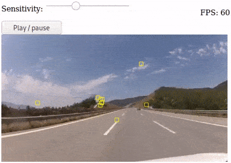

# speedy-vision.js

A **lightning fast GPU-accelerated** feature detection and matching library for Computer Vision on the web.

[](https://alemart.github.io/speedy-vision-js/demos/video-features.html)

[Click to open a demo](https://alemart.github.io/speedy-vision-js/demos/video-features.html)

## Table of contents

* [Motivation](#motivation)
* [Demos](#demos)
* [Installation](#installation)
* [API Reference](#api-reference)
  * [Media elements](#media-elements)
  * [Feature detection](#feature-detection)
  * [Feature matching](#feature-matching)
  * [Extras](#extras)

## Motivation

Detecting features in an image is an important step of many computer vision algorithms. Traditionally, the computationally expensive nature of this process made it difficult to **bring interactive Computer Vision applications to the web browser**. The framerates were unsatisfactory for a compelling user experience. Speedy, a short name for speedy-vision.js, is a JavaScript library created to address this issue.

Speedy's incredible performance on the web browser is possible thanks to its efficient GPU implementations and fast computer vision algorithms. With an easy-to-use API, Speedy is an excellent choice for real-time computer vision projects involving tasks such as: object detection in videos, pose estimation, Simultaneous Location and Mapping (SLAM), and many others.

Speedy is developed by [Alexandre Martins](https://github.com/alemart), a computer scientist from Brazil. It is released under the [Apache-2.0 license](LICENSE) and uses the excellent [GPU.js](https://github.com/gpujs/gpu.js) library.


*Speedy feature detection - Photo by JD Hancock (CC-BY)*

## Demos

Try the demos and take a look at their source code:

* Feature detection
  * [Hello, world!](https://alemart.github.io/speedy-vision-js/demos/hello-world.html) (start here)
  * [Feature detection in an image](https://alemart.github.io/speedy-vision-js/demos/image-features.html)
  * [Feature detection in a video](https://alemart.github.io/speedy-vision-js/demos/video-features.html)
  * [Feature detection in a webcam](https://alemart.github.io/speedy-vision-js/demos/webcam-features.html)
  * [Find a specific number of features](https://alemart.github.io/speedy-vision-js/demos/webcam-features.html) (automatic sensitivity)

## Installation

Download the latest release of speedy-vision.js and include it in the `<head>` section of your HTML page:

```html
<script src="dist/speedy-vision.min.js" async></script>
```

Once you import the library, the `Speedy` object will be exposed.

```js
// Load an image with Speedy
let image = document.querySelector('img');
let media = await Speedy.load(image);

// Find its features
let features = await media.findFeatures();
for(let feature of features)
    console.log(feature.x, feature.y);
```

Check out the [Hello World demo](demos/hello-world.html) for a working example.

## API Reference

### Media elements

Before you detect any features, you must provide Speedy some media. A `SpeedyMedia` object encapsulates a media object such as an image, a video, or a canvas.

#### Loading your media

##### Speedy.load()

`Speedy.load(sourceElement): Promise<SpeedyMedia>`

Tells Speedy to load `sourceElement`. The `sourceElement` parameter is the source from which you will extract the features.

###### Arguments:

* `sourceElement: HTMLImageElement | HTMLVideoElement | HTMLCanvasElement`. The media from which you intend to extract the features.

###### Returns:

A `Promise<SpeedyMedia>` that resolves as soon as the media source is loaded.

###### Example:

```js
let image = document.getElementById('my-image');
let media = await Speedy.load(image);
```

#### Examining your media

##### SpeedyMedia.source

`SpeedyMedia.source: HTMLImageElement | HTMLVideoElement | HTMLCanvasElement, read-only`

The media element associated with the `SpeedyMedia` object.

##### SpeedyMedia.width

`SpeedyMedia.width: number, read-only`

The width of the media element, in pixels.

##### SpeedyMedia.height

`SpeedyMedia.height: number, read-only`

The height of the media element, in pixels.

##### SpeedyMedia.type

`SpeedyMedia.type: string, read-only`

One of the following: `"image"`, `"video"`, `"canvas"`.

### Feature detection

#### Finding features

##### SpeedyMedia.findFeatures()

`SpeedyMedia.findFeatures(config?): Promise< Array<SpeedyFeature> >`

Detects features in a `SpeedyMedia`.

###### Arguments:

* `config: object, optional`. A configuration object that accepts the following keys (all are optional):
  * `method: string`. Name of the method to be used to detect the features.
  * `sensitivity: number`. A number between `0.0` and `1.0`. The higher the number, the more features you get.
  * `expected: number | object`. The algorithm will automatically adjust the sensitivity value to get you *approximately* the number of features you ask. This options requires multiple calls to work (see the note on [automatic sensitivity](#automatic-sensitivity) below).

The configuration object accepts more keys depending on which method is specified. Currently, the following methods for feature detection are available:

| Method   | Description                  |
|----------|------------------------------|
|`"fast"`  | An alias for `"fast9"`       |
|`"fast9"` | Runs the FAST-9,16 algorithm |
|`"fast7"` | Runs the FAST-7,12 algorithm |
|`"fast5"` | Runs the FAST-5,8 algorithm  |

The default method is `"fast"`. Different methods yield different results.

**FAST algorithm**

For any variation of the FAST algorithm[1], the `config` object accepts the following additional keys:

* `threshold: number`. An alternative to `sensitivity` representing the threshold paramter of FAST: an integer between `0` and `255`, inclusive. Lower thresholds get you more features.
* `denoise: boolean`. Whether or not to apply a gaussian filter to denoise the image before finding the features. Defaults to `true`.

Note: `config.sensitivity` is an easy-to-use parameter and does *not* map linearly to `config.threshold`.

[1] Rosten, Edward; Drummond, Tom. "Machine learning for high-speed corner detection". European Conference on Computer Vision (ECCV-2006).

###### Returns:

A `Promise` that resolves to an array of `SpeedyFeature` objects.

###### Example:

```js
window.onload = async function() {
    let image = document.querySelector('img');
    let media = await Speedy.load(image);
    let features = await media.findFeatures({
        method: 'fast',
        settings: {
            sensitivity: 0.5
        }
    });

    for(let feature of features) {
        let x = feature.x;
        let y = feature.y;
        console.log(x, y);
    }
}
```

**Automatic sensitivity**

When you specify the number of features you expect to get, Speedy will automatically learn a sensitivity value that gives you that number (within a tolerance range). It takes a few calls to the feature detector for Speedy to adjust the sensitivity. Multiple calls is what you will be doing anyway if you need to detect features in a video (see the example below).

Speedy finds the feature points on the GPU. Although this is an efficient process, downloading data from the GPU is an expensive operation. The more features you get, the more data has to be downloaded from the GPU. This impacts performance. The sensitivity value alone does not give you control of how many feature points you will get. **Setting an expected number of feature points may thus help you with stability and performance**. 

The `config.expected` option can either be a number or an object with the following keys:

* `number: number`. The number of features you expect to get.
* `tolerance: number`. A range defined as a percentage relative to the number of features you expect. Defaults to `0.10` (10%).

Expected numbers between 100 and 500 have been found to work well in practice (the less, the better). Your results may vary depending on your media. If you need very large numbers and don't care about the amount, it's easier to adjust the sensitivity manually. If you need small numbers, you might want to increase the tolerance.

###### Example:

```js
//const video = document.getElementById('my-video');
//const media = await Speedy.load(video);
const FPS = 60;
let features = [];

// give me 100 feature points
setInterval(function() {
    media.findFeatures({
        expected: 100
    }).then(f => {
        features = f;
        console.log(`Found ${features.length} features`);
    });
}, 1000.0 / FPS);
```

#### Examining your feature points

A `SpeedyFeature` object represents an image feature.

##### SpeedyFeature.x

`SpeedyFeature.x: number, read-only`

The x position of the image feature.

##### SpeedyFeature.y

`SpeedyFeature.y: number, read-only`

The y position of the image feature.

### Feature matching

Coming soon!

### Extras

#### Frames per second (FPS)

Speedy includes a FPS counter for testing purposes. It will be created only if you access it.

##### Speedy.fps.value

`Speedy.fps.value: number, read-only`

Gets the FPS rate.

###### Example:

```js
console.log(Speedy.fps.value);
```

#### Misc

##### Speedy.version

`Speedy.version: string, read-only`

The version of the library.
