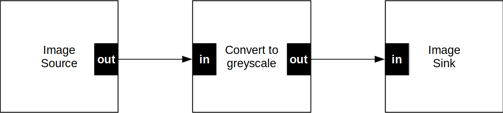

# speedy-vision.js

Build real-time stuff with **speedy-vision.js**, a GPU-accelerated Computer Vision library for JavaScript.

[](https://alemart.github.io/speedy-vision/demos/best-features.html "Click to open a demo")

## Features

* Feature detection
  * Harris corner detector
  * FAST feature detector
  * ORB feature descriptor
* Feature tracking
  * KLT feature tracker
  * LK optical flow
* Feature matching
  * Soon
* Geometric transformations
  * Homography matrix
  * Affine transform
* Image processing
  * Convert to greyscale
  * Convolution
  * Gaussian blur, box & median filters
  * Contrast and brightness adjustment
  * Image normalization & warping
  * Image pyramids
* Linear Algebra
  * Beautiful matrix algebra with a fluent interface
  * Efficient computations with WebAssembly
  * Systems of linear equations
  * QR decomposition

... and more in development!

There are plenty of [demos](#demos) available!

## Author

**speedy-vision.js** is developed by [Alexandre Martins](https://github.com/alemart), a computer scientist from Brazil. It is released under the [Apache-2.0 license](LICENSE).

If my work is of value to you, [make a donation](https://www.paypal.com/donate?hosted_button_id=JS6AR2WMLAJTY). Thank you.

For general enquiries, contact me at `alemartf` `at` `gmail` `dot` `com`.

-----

## Table of contents

* [Demos](#demos)
* [Installation](#installation)
* [Motivation](#motivation)
* [The Pipeline](#the-pipeline)
* [API Reference](#api-reference)
  * [Media routines](#media-routines)
    * [Loading your media](#loading-your-media)
    * [Media properties](#media-properties)
    * [Playing with your media](#playing-with-your-media)
  * [Pipeline](#pipeline)
    * [Basic routines](#basic-routines)
    * [Basic properties](#basic-properties)
    * [Basic nodes](#basic-nodes)
  * [Image processing](#image-processing)
    * [Image basics](#image-basics)
    * [Image filters](#image-filters)
    * [General transformations](#general-transformations)
  * [Keypoints and descriptors](#keypoints-and-descriptors)
    * [Keypoint basics](#keypoint-basics)
    * [Keypoint detection](#keypoint-detection)
    * [Keypoint description](#keypoint-description)
    * [Keypoint tracking (optical-flow)](#keypoint-tracking)
    * [Keypoint matching](#keypoint-matching)
  * [Portals](#portals)
    * [Image Portals](#image-portals)
    * [Keypoint Portals](#keypoint-portals)
  * [Linear Algebra](#linear-algebra)
    * [Creating new matrices](#creating-new-matrices)
    * [Matrix properties](#matrix-properties)
    * [Reading from the matrices](#reading-from-the-matrices)
    * [Writing to the matrices](#writing-to-the-matrices)
    * [Elementary operations](#elementary-operations)
    * [Access by block](#access-by-block)
    * [Functional programming](#functional-programming)
    * [Systems of equations](#systems-of-equations)
    * [Matrix factorization](#matrix-factorization)
  * [Geometric transformations](#geometric-transformations)
    * [Homography](#perspective-transformation)
  * [Geometric Utilities](#geometric-utilities)
    * [2D vectors](#2d-vectors)
    * [2D points](#2d-points)
    * [2D size](#2d-size)
  * [Extras](#extras)
    * [Promises](#promises)
    * [Utilities](#utilities)
* [Unit tests](https://alemart.github.io/speedy-vision/tests/index.html)

## Demos

Try the demos and take a look at their source code:

* [Hello, world!](https://alemart.github.io/speedy-vision/demos/hello-world.html)
* Feature detection
  * [Feature detection in a webcam](https://alemart.github.io/speedy-vision/demos/webcam-demo.html)
  * [Feature detection in an image](https://alemart.github.io/speedy-vision/demos/image-features.html)
  * [Feature detection in a video](https://alemart.github.io/speedy-vision/demos/video-features.html)
  * [Find the best Harris corners](https://alemart.github.io/speedy-vision/demos/best-features.html)
  * [ORB features](https://alemart.github.io/speedy-vision/demos/orb-features.html)
* Feature tracking
  * [Optical flow](https://alemart.github.io/speedy-vision/demos/optical-flow.html)
* Image processing
  * [Image convolution](https://alemart.github.io/speedy-vision/demos/convolution.html)
  * [Image warping](https://alemart.github.io/speedy-vision/demos/warping.html)
  * [Alpha blending](https://alemart.github.io/speedy-vision/demos/alpha-blending.html)
  * [Resize image](https://alemart.github.io/speedy-vision/demos/resize-image.html)
  * [Nightvision camera](https://alemart.github.io/speedy-vision/demos/nightvision-camera.html)
  * [Convert image to greyscale](https://alemart.github.io/speedy-vision/demos/greyscale-image.html)
  * [Convert video to greyscale](https://alemart.github.io/speedy-vision/demos/greyscale-video.html)
  * [Blurring an image](https://alemart.github.io/speedy-vision/demos/image-blurring.html)
  * [Blurring a video with a median filter](https://alemart.github.io/speedy-vision/demos/median-filter.html)
  * [Normalize camera stream](https://alemart.github.io/speedy-vision/demos/normalize-demo.html)
  * [Image Portals](https://alemart.github.io/speedy-vision/demos/image-portal.html)
* Linear Algebra
  * [System of equations](https://alemart.github.io/speedy-vision/demos/system-of-equations.html)
  * [QR decomposition](https://alemart.github.io/speedy-vision/demos/qr-decomposition.html)

## Installation

Download the latest release of speedy-vision.js and include it in the `<head>` section of your HTML page:

```html
<script src="dist/speedy-vision.min.js"></script>
```

Once you import the library, the `Speedy` object will be exposed. Check out the [Hello World demo](https://alemart.github.io/speedy-vision/demos/hello-world.html) for a working example.

## Motivation

Detecting features in an image is an important step of many computer vision algorithms. Traditionally, the computationally expensive nature of this process made it difficult to bring interactive Computer Vision applications to the web browser. The framerates were unsatisfactory for a compelling user experience. Speedy, a short name for speedy-vision.js, is a JavaScript library created to address this issue.

Speedy's real-time performance in the web browser is possible thanks to its efficient WebGL2 backend and to its GPU implementations of fast computer vision algorithms. With an easy-to-use API, Speedy is an excellent choice for real-time computer vision projects involving tasks such as: object detection in videos, pose estimation, Simultaneous Location and Mapping (SLAM), and others.

## The Pipeline

The pipeline is a central concept in Speedy. It's a powerful structure that lets you organize the computations that take place in the GPU. It's a very flexible, yet conceptually simple, way of working with computer vision and image processing. Let's define a few things:

- A **pipeline** is a network of **nodes** in which data flows downstream from one or more sources to one or more sinks.
- Nodes have input and/or output **ports**. A node with no input ports is called a **source**. A node with no output ports is called a **sink**. A node with both input and output ports transforms the input data in some way and writes the results to its output port(s).
- A **link** connects an output port of a node to an input port of another node. Two nodes are said to be connected if there is a link connecting their ports. Data flows from one node to another by means of a link. An input port may only be connected to a single output port, but an output port may be connected to multiple input ports.
- Input ports expect data of a certain **type** (e.g., an image). Output ports hold data of a certain type. Two ports may only be connected if their types match.
- Ports may impose additional **constraints** on the data passing through them. For example, an input port may expect an image and also impose the constraint that this image must be greyscale.
- Different nodes may have different **parameters**. These parameters can be adjusted and are meant to modify the output of the nodes in some way.
- Nodes and their ports have **names**. An input port is typically called `"in"`. An output port is typically called `"out"`. These names can vary, e.g., if a node has more than one input / output port. Speedy automatically assigns names to the nodes, but you can assign your own names as well.

The picture below shows a visual representation of a pipeline that converts an image or video to greyscale. Data gets into the pipeline via the image source. It is then passed to the Convert to greyscale node. Finally, a greyscale image goes into the image sink, where it gets out of the pipeline.



Here's a little bit of code:

```js
// Load an image
const img = document.querySelector('img');
const media = await Speedy.load(img);

// Create the pipeline and the nodes
const pipeline = Speedy.Pipeline();
const source = Speedy.Image.Source();
const sink = Speedy.Image.Sink();
const greyscale = Speedy.Filter.Greyscale();

// Set the media source
source.media = media; // media is a SpeedyMedia object

// Connect the nodes
source.output().connectTo(greyscale.input());
greyscale.output().connectTo(sink.input());

// Specify the nodes to initialize the pipeline
pipeline.init(source, sink, greyscale);

// Run the pipeline
const { image } = await pipeline.run(); // image is a SpeedyMedia

// Create a <canvas> to display the result
const canvas = document.createElement('canvas');
canvas.width = image.width;
canvas.height = image.height;
document.body.appendChild(canvas);

// Display the result
const ctx = canvas.getContext('2d');
ctx.drawImage(media.source, 0, 0);
```

Speedy provides many types of nodes. You can connect these nodes in a way that is suitable to your application, and Speedy will bring back the results you ask for.

## API Reference

### Media routines

A `SpeedyMedia` object encapsulates a media object: an image, a video, a canvas or a bitmap.

#### Loading your media

##### Speedy.load()

`Speedy.load(source: HTMLImageElement | HTMLVideoElement | HTMLCanvasElement | ImageBitmap, options?: object): SpeedyPromise<SpeedyMedia>`

Tells Speedy to load `source`. The `source` parameter may be an image, a video, a canvas or a bitmap.

###### Arguments

* `source: HTMLImageElement | HTMLVideoElement | HTMLCanvasElement | ImageBitmap`. The media source.
* `options: object, optional`. Additional options for advanced configuration. See [SpeedyMedia.options](#speedymediaoptions) for details.

###### Returns

A `SpeedyPromise<SpeedyMedia>` that resolves as soon as the media source is loaded.

###### Example

```js
window.onload = async function() {
    let image = document.getElementById('my-image'); // 
    let media = await Speedy.load(image);
}
```

##### Speedy.camera()

`Speedy.camera(width?: number, height?: number): SpeedyPromise<SpeedyMedia>`

`Speedy.camera(constraints: MediaStreamConstraints): SpeedyPromise<SpeedyMedia>`

Loads a camera stream into a new `SpeedyMedia` object. This is a wrapper around `navigator.mediaDevices.getUserMedia()`, provided for your convenience.

###### Arguments

* `width: number, optional`. The ideal width of the stream. The browser will use this value or a close match. Defaults to `640`.
* `height: number, optional`. The ideal height of the stream. The browser will use this value or a close match. Defaults to `360`.
* `constraints: MediaStreamConstraints`. A [MediaStreamConstraints](https://developer.mozilla.org/en-US/docs/Web/API/MediaStreamConstraints) dictionary to be passed to `getUserMedia()` for complete customization.

###### Returns

A `SpeedyPromise<SpeedyMedia>` that resolves as soon as the media source is loaded with the camera stream.

###### Example

```js
// Display the contents of a webcam
window.onload = async function() {
    const media = await Speedy.camera();
    const canvas = createCanvas(media.width, media.height);
    const ctx = canvas.getContext('2d');

    function render()
    {
        ctx.drawImage(media.source, 0, 0);
        requestAnimationFrame(render);
    }

    render();
}

function createCanvas(width, height)
{
    const canvas = document.createElement('canvas');

    canvas.width = width;
    canvas.height = height;
    document.body.appendChild(canvas);

    return canvas;
}
```

##### SpeedyMedia.release()

`SpeedyMedia.release(): null`

Releases internal resources associated with this `SpeedyMedia`.

###### Returns

Returns `null`.

#### Media properties

##### SpeedyMedia.source

`SpeedyMedia.source: HTMLImageElement | HTMLVideoElement | HTMLCanvasElement | ImageBitmap, read-only`

The media source associated with the `SpeedyMedia` object.

##### SpeedyMedia.type

`SpeedyMedia.type: string, read-only`

The type of the media source. One of the following: `"image"`, `"video"`, `"canvas"`, `"bitmap"`.

##### SpeedyMedia.width

`SpeedyMedia.width: number, read-only`

The width of the media source, in pixels.

##### SpeedyMedia.height

`SpeedyMedia.height: number, read-only`

The height of the media source, in pixels.

##### SpeedyMedia.size

`SpeedyMedia.size: SpeedySize, read-only`

The size of the media, in pixels.

##### SpeedyMedia.options

`SpeedyMedia.options: object, read-only`

Read-only object defined when [loading the media](#speedyload). Deprecated.

#### Playing with your media

##### SpeedyMedia.clone()

`SpeedyMedia.clone(): SpeedyPromise<SpeedyMedia>`

Clones the `SpeedyMedia` object.

###### Returns

A `SpeedyPromise` that resolves to a clone of the `SpeedyMedia` object.

###### Example

```js
const clone = await media.clone();
```

##### SpeedyMedia.toBitmap()

`SpeedyMedia.toBitmap(): SpeedyPromise<ImageBitmap>`

Converts the media to an `ImageBitmap`.

###### Returns

A `SpeedyPromise` that resolves to an `ImageBitmap`.

### Pipeline

#### Basic routines

##### Speedy.Pipeline.Pipeline()

`Speedy.Pipeline.Pipeline(): SpeedyPipeline`

Creates a new, empty pipeline.

###### Returns

A new `SpeedyPipeline` object.

##### SpeedyPipeline.init()

`SpeedyPipeline.init(...nodes: ...SpeedyPipelineNode): SpeedyPipeline`

Initializes a pipeline with the specified `nodes`.

###### Arguments

* `...nodes: ...SpeedyPipelineNode`. The list of nodes that belong to the pipeline.

###### Returns

The pipeline itself.

###### Example

```js
const pipeline = Speedy.Pipeline(); // create the pipeline and the nodes
const source = Speedy.Image.Source();
const sink = Speedy.Image.Sink();
const greyscale = Speedy.Filter.Greyscale();

source.media = media; // set the media source

source.output().connectTo(greyscale.input()); // connect the nodes
greyscale.output().connectTo(sink.input());

pipeline.init(source, sink, greyscale); // add the nodes to the pipeline
```

##### SpeedyPipeline.release()

`SpeedyPipeline.release(): null`

Releases the resources associated with `this` pipeline.

###### Returns

Returns `null`.

##### SpeedyPipeline.run()

`SpeedyPipeline.run(): SpeedyPromise<object>`

Runs `this` pipeline.

###### Returns

Returns a `SpeedyPromise` that resolves to an object whose keys are the names of the sinks of the pipeline and whose values are the data exported by those sinks.

###### Example

```js
const { sink1, sink2 } = await pipeline.run();
```

##### SpeedyPipeline.node()

`SpeedyPipeline.node(name: string): SpeedyPipelineNode | null`

Finds a node by its `name`.

###### Arguments

* `name: string`. Name of the target node.

###### Returns

Returns a `SpeedyPipelineNode` that has the specified `name` and that belongs to `this` pipeline, or `null` if there is no such node.

##### SpeedyPipelineNode.input()

`SpeedyPipelineNode.input(portName?: string): SpeedyPipelineNodePort`

The input port of `this` node whose name is `portName`.

###### Arguments

* `portName: string, optional`. The name of the port you want to access. Defaults to `"in"`.

###### Returns

The requested input port.

##### SpeedyPipelineNode.output()

`SpeedyPipelineNode.output(portName?: string): SpeedyPipelineNodePort`

The output port of `this` node whose name is `portName`.

###### Arguments

* `portName: string, optional`. The name of the port you want to access. Defaults to `"out"`.

###### Returns

The requested output port.

##### SpeedyPipelineNodePort.connectTo()

`SpeedyPipelineNodePort.connectTo(port: SpeedyPipelineNodePort): void`

Creates a link connecting `this` port to another `port`.

#### Basic properties

##### SpeedyPipelineNode.name

`SpeedyPipelineNode.name: string, read-only`

The name of the node.

##### SpeedyPipelineNode.fullName

`SpeedyPipelineNode.fullName: string, read-only`

A string that exhibits the name and the type of the node.

##### SpeedyPipelineNodePort.name

`SpeedyPipelineNodePort.name: string, read-only`

The name of the port.

##### SpeedyPipelineNodePort.node

`SpeedyPipelineNodePort.node: SpeedyPipelineNode, read-only`

The node to which `this` port belongs.

#### Basic nodes

##### Speedy.Image.Source()

`Speedy.Image.Source(name?: string): SpeedyPipelineNodeImageInput`

Creates an image source with the specified name. If the name is not specified, Speedy will automatically generate a name for you.

###### Parameters

* `media: SpeedyMedia`. The media to be imported into the pipeline.

###### Ports

| Port name | Data type | Description |
|-----------|-----------|-------------|
| `"out"`   | Image     | An image corresponding to the `media` of this node. |

##### Speedy.Image.Sink()

`Speedy.Image.Sink(name?: string): SpeedyPipelineNodeImageOutput`

Creates an image sink with the specified name. If the name is not specified, Speedy will call this node `"image"`. A `SpeedyMedia` object will be exported from the pipeline.

###### Ports

| Port name | Data type | Description |
|-----------|-----------|-------------|
| `"in"`    | Image     | An image to be exported from the pipeline. |

### Image processing

#### Image basics

##### Speedy.Image.Pyramid()

`Speedy.Image.Pyramid(name?: string): SpeedyPipelineNodeImagePyramid`

Generate a Gaussian pyramid. A pyramid is a texture with mipmaps.

| Port name | Data type | Description |
|-----------|-----------|-------------|
| `"in"`    | Image     | Input image. |
| `"out"`   | Image     | Gaussian pyramid. |

##### Speedy.Image.Multiplexer()

`Speedy.Image.Multiplexer(name?: string): SpeedyPipelineNodeImageMultiplexer`

An image multiplexer receives two images as input and outputs one of the them.

###### Parameters

* `port: number`. Which input image should be redirected to the output: `0` or `1`? Defaults to `0`.

###### Ports

| Port name | Data type | Description |
|-----------|-----------|-------------|
| `"in0"`   | Image     | First image. |
| `"in1"`   | Image     | Second image. |
| `"out"`   | Image     | Either the first or the second image, depending on the value of `port`. |

##### Speedy.Image.Buffer()

`Speedy.Image.Buffer(name?: string): SpeedyPipelineNodeImageBuffer`

An image buffer outputs at time *t* the input image received at time *t-1*. It's useful for tracking.

**Note:** an image buffer cannot be used to store a pyramid at this time.

###### Parameters

* `frozen: boolean`. A frozen buffer discards the input, effectively increasing the buffering time. Defaults to `false`.

###### Ports

| Port name | Data type | Description |
|-----------|-----------|-------------|
| `"in"`    | Image     | Input image at time *t*. |
| `"out"`   | Image     | Output image: the input image at time *t-1*. |

##### Speedy.Image.Mixer()

`Speedy.Image.Mixer(name?: string): SpeedyPipelineNodeImageMixer`

An image mixer combines two images, *image0* and *image1*, as follows:

*output* = `alpha` * *image0* + `beta` * *image1* + `gamma`

The above expression will be computed for each pixel of the resulting image and then clamped to the [0,1] interval. The dimensions of the resulting image will be the dimensions of the larger of the input images.

**Note:** Both input images must have the same format. If they're colored, the above expression will be evaluated in each color channel independently.

**Tip:** if you pick an `alpha` between 0 and 1, set `beta` to `1 - alpha` and set `gamma` to 0, you'll get a nice alpha blending effect.

###### Parameters

* `alpha: number`. A scalar value. Defaults to 0.5.
* `beta: number`. A scalar value. Defaults to 0.5.
* `gamma: number`. A scalar value. Defaults to 0.0.

###### Ports

| Port name | Data type | Description |
|-----------|-----------|-------------|
| `"in0"`   | Image     | Input image: the *image0* above |
| `"in1"`   | Image     | Input image: the *image1* above |
| `"out"`   | Image     | Output image |

#### Image filters

##### Speedy.Filter.Greyscale()

`Speedy.Filter.Greyscale(name?: string): SpeedyPipelineNodeGreyscale`

Convert an image to greyscale.

###### Ports

| Port name | Data type | Description |
|-----------|-----------|-------------|
| `"in"`    | Image     | Input image. |
| `"out"`   | Image     | The input image converted to greyscale. |

##### Speedy.Filter.SimpleBlur()

`Speedy.Filter.SimpleBlur(name?: string): SpeedyPipelineNodeSimpleBlur`

Blur an image using a box filter.

###### Parameters

* `kernelSize: SpeedySize`. The size of the convolution kernel: from 3x3 to 15x15. Defaults to 5x5.

###### Ports

| Port name | Data type | Description |
|-----------|-----------|-------------|
| `"in"`    | Image     | Input image. |
| `"out"`   | Image     | The input image, blurred. |

##### Speedy.Filter.GaussianBlur()

`Speedy.Filter.SimpleBlur(name?: string): SpeedyPipelineNodeGaussianBlur`

Blur an image using a Gaussian filter.

###### Parameters

* `kernelSize: SpeedySize`. The size of the convolution kernel: from 3x3 to 15x15. Defaults to 5x5.
* `sigma: SpeedyVector2`. The sigma of the Gaussian function in both x and y axes. If set to the zero vector, Speedy will automatically pick a sigma according to the selected `kernelSize`. Defaults to (0,0).

###### Ports

| Port name | Data type | Description |
|-----------|-----------|-------------|
| `"in"`    | Image     | Input image. |
| `"out"`   | Image     | The input image, blurred. |

##### Speedy.Filter.MedianBlur()

`Speedy.Filter.MedianBlur(name?: string): SpeedyPipelineNodeMedianBlur`

Median filter.

###### Parameters

* `kernelSize: SpeedySize`. One of the following: 3x3, 5x5 or 7x7. Defaults to 5x5.

###### Ports

| Port name | Data type | Description |
|-----------|-----------|-------------|
| `"in"`    | Image     | A greyscale image. |
| `"out"`   | Image     | The result of the median blur. |

###### Example

```js
const median = Speedy.Filter.MedianBlur();
median.kernelSize = Speedy.Size(7,7);
```

##### Speedy.Filter.Convolution()

`Speedy.Filter.Convolution(name?: string): SpeedyPipelineNodeConvolution`

Compute the convolution of an image using a 2D kernel.

###### Parameters

* `kernel: SpeedyMatrixExpr`. A 3x3, 5x5 or 7x7 matrix.

###### Ports

| Port name | Data type | Description |
|-----------|-----------|-------------|
| `"in"`    | Image     | Input image. |
| `"out"`   | Image     | The result of the convolution. |

###### Example

```js
// Sharpening an image
const sharpen = Speedy.Filter.Convolution();
sharpen.kernel = Speedy.Matrix(3, 3, [
    0,-1, 0,
   -1, 5,-1,
    0,-1, 0
]);
```

##### Speedy.Filter.Normalize()

`Speedy.Filter.Normalize(name?: string): SpeedyPipelineNodeNormalize`

Normalize the intensity values of the input image to the [`minValue`, `maxValue`] interval.

###### Parameters

* `minValue: number`. A value in [0,255].
* `maxValue: number`. A value in [0,255] greater than or equal to `minValue`.

###### Ports

| Port name | Data type | Description |
|-----------|-----------|-------------|
| `"in"`    | Image     | Greyscale image. |
| `"out"`   | Image     | Normalized image. |

##### Speedy.Filter.Nightvision()

`Speedy.Filter.Nightvision(name?: string): SpeedyPipelineNodeNightvision`

Nightvision filter for local contrast stretching and brightness control.

###### Parameters

* `gain: number`. A value in [0,1]: the larger the number, the higher the contrast. Defaults to `0.5`.
* `offset: number`. A value in [0,1] that controls the brightness. Defaults to `0.5`.
* `decay: number`. A value in [0,1] specifying a contrast decay from the center of the image. Defaults to zero (no decay).
* `quality: string`. Quality level: `"high"`, `"medium"` or `"low"`. Defaults to `"medium"`.

###### Ports

| Port name | Data type | Description |
|-----------|-----------|-------------|
| `"in"`    | Image     | Input image. |
| `"out"`   | Image     | Output image. |

#### General transformations

##### Speedy.Transform.Resize()

`Speedy.Transform.Resize(name?: string): SpeedyPipelineNodeResize`

Resize an image.

###### Parameters

* `size: SpeedySize`. The size of the output image, in pixels. If set to zero, `scale` will be used to determine the size of the output. Defaults to zero.
* `scale: SpeedyVector2`. The size of the output image relative to the size of the input image. This parameter is only applied if `size` is zero. Defaults to (1,1), meaning: keep the original size.
* `method: string`. Resize method. One of the following: `"bilinear"` (bilinear interpolation) or `"nearest"` (nearest neighbors). Defaults to `"bilinear"`.

###### Ports

| Port name | Data type | Description |
|-----------|-----------|-------------|
| `"in"`    | Image     | Input image. |
| `"out"`   | Image     | Resized image. |

##### Speedy.Transform.PerspectiveWarp()

`Speedy.Transform.PerspectiveWarp(name?: string): SpeedyPipelineNodePerspectiveWarp`

Warp an image using a [homography matrix](#perspective-transformation).

###### Parameters

* `transform: SpeedyMatrixExpr`. A 3x3 perspective transformation. Defaults to the identity matrix.

###### Ports

| Port name | Data type | Description |
|-----------|-----------|-------------|
| `"in"`    | Image     | Input image. |
| `"out"`   | Image     | Warped image. |

### Keypoints and descriptors

A **keypoint** is a small patch in an image that is somehow *distinctive*. For example, a small patch with significant intensity changes in both x and y axes (i.e., a "corner") is distinctive. If we pick two "similar" images, we should be able to locate a set of keypoints in each of them and then match those keypoints based on their similarity.

A **descriptor** is a mathematical object that somehow describes a keypoint. Two keypoints are considered to be "similar" if their descriptors are "similar". Speedy works with binary descriptors, meaning that keypoints are described using bit vectors of fixed length.

There are different ways to detect and describe keypoints. For example, in order to detect a keypoint, you may take a look at the pixel intensities around a point or perhaps study the image derivatives. You may describe a keypoint by comparing the pixel intensities of the image patch in a special way. Additionally, it's possible to conceive a way to describe a keypoint in such a way that, if you rotate the patch, the descriptor stays roughly the same. This is called *rotational invariance* and is usually a desirable property for a descriptor.

Speedy offers different options for processing keypoints in multiple ways. A novelty of this work is that Speedy's implementations have been either adapted from the literature or conceived from scratch to work on the GPU. Therefore, keypoint processing is done in parallel and is often very fast.

#### Keypoint basics

##### SpeedyKeypoint

A `SpeedyKeypoint` object represents a keypoint.

###### SpeedyKeypoint.position

`SpeedyKeypoint.position: SpeedyPoint2`

The position of the keypoint in the image.

###### SpeedyKeypoint.x

`SpeedyKeypoint.x: number`

The x position of the keypoint in the image. A shortcut to `position.x`.

###### SpeedyKeypoint.y

`SpeedyKeypoint.y: number`

The y position of the keypoint in the image. A shortcut to `position.y`.

###### SpeedyKeypoint.lod

`SpeedyKeypoint.lod: number`

The level-of-detail (pyramid level) from which the keypoint was extracted, starting from zero. Defaults to `0.0`.

###### SpeedyKeypoint.scale

`SpeedyKeypoint.scale: number`

The scale of the keypoint. This is equivalent to *2 ^ lod*. Defaults to `1.0`.

###### SpeedyKeypoint.rotation

`SpeedyKeypoint.rotation: number`

The orientation angle of the keypoint, in radians. Defaults to `0.0`.

###### SpeedyKeypoint.score

`SpeedyKeypoint.score: number`

The score is a measure associated with the keypoint. Although different detection methods employ different measurement strategies, the larger the score, the "better" the keypoint is considered to be. The score is always a positive value.

###### SpeedyKeypoint.descriptor

`SpeedyKeypoint.descriptor: SpeedyKeypointDescriptor | null, read-only`

The descriptor associated with the keypoint, if it exists.

##### SpeedyKeypointDescriptor

A `SpeedyKeypointDescriptor` represents a keypoint descriptor.

###### SpeedyKeypointDescriptor.data

`SpeedyKeypointDescriptor.data: Uint8Array, read-only`

The bytes of the keypoint descriptor.

###### SpeedyKeypointDescriptor.size

`SpeedyKeypointDescriptor.size: number, read-only`

The size of the keypoint descriptor, in bytes.

###### SpeedyKeypointDescriptor.toString()

`SpeedyKeypointDescriptor.toString(): string`

Returns a string representation of the keypoint descriptor.

##### SpeedyTrackedKeypoint

A `SpeedyTrackedKeypoint` is a `SpeedyKeypoint` with the following additional properties:

###### SpeedyTrackerKeypoint.flow

`SpeedyTrackedKeypoint.flow: SpeedyVector2`

A displacement vector associated with the tracked keypoint.

##### Speedy.Keypoint.Source()

`Speedy.Keypoint.Source(name?: string): SpeedyPipelineNodeKeypointSource`

Creates a source of keypoints. Only the position, score and scale of the provided keypoints will be imported to the pipeline. Descriptors, if present, will be lost.

###### Parameters

* `keypoints: SpeedyKeypoint[]`. The keypoints you want to import.
* `capacity: number`. The maximum number of keypoints that can be imported to the GPU. If you have an idea of how many keypoints you expect (at most), use a tight bound to make processing more efficient. The default capacity is `2048`. It can be no larger than `8192`.

###### Ports

| Port name | Data type | Description |
|-----------|-----------|-------------|
| `"out"`   | Keypoints | The imported set of keypoints. |

##### Speedy.Keypoint.Sink()

`Speedy.Keypoint.Sink(name?: string): SpeedyPipelineNodeKeypointSink`

Creates a sink of keypoints using the specified name. If the name is not specified, Speedy will call this node `"keypoints"`. An array of `SpeedyKeypoint` objects will be exported from the pipeline.

###### Parameters

* `turbo: boolean`. Accelerate GPU-CPU transfers. You'll get the data from the previous frame. Defaults to `false`.
* `includeDiscarded: boolean`. Set discarded keypoints (e.g., by a tracker) to `null` in the exported set. Defaults to `false`, meaning that discarded keypoints will simply be dropped from the exported set rather than being set to `null`.

###### Ports

| Port name | Data type | Description |
|-----------|-----------|-------------|
| `"in"`    | Keypoints | A set of keypoints to be exported from the pipeline. |

##### Speedy.Keypoint.SinkOfTrackedKeypoints()

`Speedy.Keypoint.SinkOfTrackedKeypoints(name?: string): SpeedyPipelineNodeTrackedKeypointSink`

Creates a sink of tracked keypoints using the specified name. If the name is not specified, Speedy will call this node `"keypoints"`. An array of `SpeedyTrackedKeypoint` objects will be exported from the pipeline.

###### Parameters

The same as `SpeedyPipelineNodeKeypointSink`.

###### Ports

| Port name | Data type | Description |
|-----------|-----------|-------------|
| `"in"`    | Keypoints | A set of keypoints to be exported from the pipeline. |
| `"flow"`  | Vector2   | A set of displacement vectors associated with each keypoint. |

##### Speedy.Keypoint.Clipper()

`Speedy.Keypoint.Clipper(name?: string): SpeedyPipelineNodeKeypointClipper`

Clips a set of keypoints, so that it outputs no more than a fixed quantity of them. When generating the output, it will choose the "best" keypoints according to their score metric. The keypoint clipper is a very useful tool to reduce processing time, since it can discard "bad" keypoints regardless of the sensitivity of their detector. The clipping must be applied before computing any descriptors.

###### Parameters

* `size: number`. A positive integer. No more than this number of keypoints will be available in the output.

###### Ports

| Port name | Data type | Description |
|-----------|-----------|-------------|
| `"in"`    | Keypoints | A set of keypoints. |
| `"out"`   | Keypoints | A set of at most `size` keypoints. |

##### Speedy.Keypoint.BorderClipper()

`Speedy.Keypoint.BorderClipper(name?: string): SpeedyPipelineNodeKeypointBorderClipper`

Removes all keypoints within a specified border of the edge of an image. The border is specified in pixels as an ordered pair of integers: the first is the size of the horizontal border and the second is the size of the vertical border.

###### Parameters

* `imageSize: SpeedySize`. Image size, in pixels.
* `borderSize: SpeedyVector2`. Border size in both x and y axes. Defaults to zero, meaning that no clipping takes place.

###### Ports

| Port name | Data type | Description |
|-----------|-----------|-------------|
| `"in"`    | Keypoints | A set of keypoints. |
| `"out"`   | Keypoints | The clipped set of keypoints. |

##### Speedy.Keypoint.Mixer()

`Speedy.Keypoint.Mixer(name?: string): SpeedyPipelineNodeKeypointMixer`

Mixes (merges) two sets of keypoints.

###### Ports

| Port name | Data type | Description |
|-----------|-----------|-------------|
| `"in0"`   | Keypoints | A set of keypoints. |
| `"in1"`   | Keypoints | Another set of keypoints. |
| `"out"`   | Keypoints | The union of the two input sets. |

##### Speedy.Keypoint.Buffer()

`Speedy.Keypoint.Buffer(name?: string): SpeedyPipelineNodeKeypointBuffer`

A keypoint buffer outputs at time *t* the keypoints received at time *t-1*.

###### Parameters

* `frozen: boolean`. A frozen buffer discards the input, effectively increasing the buffering time. Defaults to `false`.

###### Ports

| Port name | Data type | Description |
|-----------|-----------|-------------|
| `"in"`    | Keypoints | A set of keypoints at time *t*. |
| `"out"`   | Keypoints | The set of keypoints received at time *t-1*. |

##### Speedy.Keypoint.Multiplexer()

`Speedy.Keypoint.Multiplexer(name?: string): SpeedyPipelineNodeKeypointMultiplexer`

A keypoint multiplexer receives two sets of keypoints as input and outputs one of the them.

###### Parameters

* `port: number`. Which input set of keypoints should be redirected to the output: `0` or `1`? Defaults to `0`.

###### Ports

| Port name | Data type | Description |
|-----------|-----------|-------------|
| `"in0"`   | Image     | First set of keypoints. |
| `"in1"`   | Image     | Second set of keypoints. |
| `"out"`   | Image     | Either the first or the second set of keypoints, depending on the value of `port`. |

##### Speedy.Keypoint.Transformer()

`Speedy.Keypoint.Transformer(name?: string): SpeedyPipelineNodeKeypointTransformer`

Applies a transformation matrix to a set of keypoints.

###### Parameters

* `transform: SpeedyMatrix`. A 3x3 homography matrix. Defaults to the identity matrix.

###### Ports

| Port name | Data type | Description |
|-----------|-----------|-------------|
| `"in"`    | Keypoints | A set of keypoints. |
| `"out"`   | Keypoints | A transformed set of keypoints. |

##### Speedy.Keypoint.SubpixelRefiner()

`Speedy.Keypoint.SubpixelRefiner(name?: string): SpeedyPipelineNodeKeypointSubpixelRefiner`

Refines the position of a set of keypoints down to the subpixel level.

**Note 1:** filter the image to reduce the noise before working at the subpixel level.

**Note 2:** if there are keypoints in multiple scales, make sure to provide a pyramid as input.

**Note 3:** the position of the keypoints is stored as fixed-point. This representation may introduce a loss of accuracy (~0.1 pixel). This is probably enough already, but if you need higher accuracy, ignore the output keypoints and work with the displacement vectors instead. These are encoded as floating-point. In addition, use the upsampling methods.

###### Parameters

* `method: string`. The method to be used to compute the subpixel displacement. See the table below.
* `maxIterations: number`. The maximum number of iterations used by methods `"bicubic-upsample"` and `"bilinear-upsample"`. Defaults to 6.
* `epsilon: number`. The threshold used to determine when the subpixel displacement has reached convergence. Used with methods `"bicubic-upsample"` and `"bilinear-upsample"`. Defaults to 0.1 pixel.

Table of methods:

| Method            | Description |
|-------------------|-------------|
| `"quadratic1d"` | Maximize a 1D parabola fit to a corner strength function. This is the default method. |
| `"taylor2d"` | Maximize a second-order 2D Taylor expansion of a corner strength function. Method `"quadratic1d"` seems to perform slightly better than this, but your mileage may vary.
| `"bicubic-upsample"` | Iteratively upsample the image using bicubic interpolation in order to maximize a corner strength function. Repeat until convergence or until a maximum number of iterations is reached. |
| `"bilinear-upsample"` | Analogous to bicubic upsample, but this method uses bilinear interpolation instead. |

###### Ports

| Port name | Data type | Description |
|-----------|-----------|-------------|
| `"image"` | Image     | An image or pyramid from which you extracted the keypoints. |
| `"keypoints"` | Keypoints | Input set of keypoints. |
| `"out"`   | Keypoints | Subpixel-refined output set of keypoints. |
| `"displacements"` | Vector2 | Displacement vectors (output). |

##### Speedy.Keypoint.DistanceFilter()

`Speedy.Keypoint.DistanceFilter(name?: string): SpeedyPipelineNodeKeypointDistanceFilter`

Given a set of pairs of keypoints, discard all pairs whose distance is above a user-defined threshold. This is useful for implementing bidirectional optical-flow.

The pairs of keypoints are provided as two separate sets, "in" and "reference". Keypoints that are kept will have their data extracted from the "in" set.

###### Parameters

* `threshold: number`. Distance threshold, given in pixels.

###### Ports

| Port name | Data type | Description |
|-----------|-----------|-------------|
| `"in"` | Keypoints | A set of keypoints. |
| `"reference"` | Keypoints | A reference set of keypoints. |
| `"out"` | Keypoints | Filtered set of keypoints. |

##### Speedy.Keypoint.HammingDistanceFilter()

`Speedy.Keypoint.HammingDistanceFilter(name?: string): SpeedyPipelineNodeKeypointHammingDistanceFilter`

Given a set of pairs of keypoints with descriptors, discard all pairs whose Hamming distance between their descriptors is above a user-defined threshold.

The pairs of keypoints are provided as two separate sets, "in" and "reference". Keypoints that are kept will have their data extracted from the "in" set.

###### Parameters

* `threshold: number`. Distance threshold, an integer.

###### Ports

| Port name | Data type | Description |
|-----------|-----------|-------------|
| `"in"` | Keypoints | A set of keypoints. |
| `"reference"` | Keypoints | A reference set of keypoints. |
| `"out"` | Keypoints | Filtered set of keypoints. |

##### Speedy.Keypoint.Shuffler()

`Speedy.Keypoint.Shuffler(name?: string): SpeedyPipelineNodeKeypointShuffler`

Shuffles the input keypoints, optionally clipping the output set.

###### Parameters

* `maxKeypoints: number`. Maximum number of keypoints of the output set. If unspecified, the number of keypoints of the output set will be the number of keypoints of the input set.

###### Ports

| Port name | Data type | Description |
|-----------|-----------|-------------|
| `"in"`    | Keypoints | A set of keypoints. |
| `"out"`   | Keypoints | The input set of keypoints, shuffled and possibly clipped. |


#### Keypoint detection

The following nodes expect greyscale images as input. They output a set of keypoints.

##### Speedy.Keypoint.Detector.FAST()

`Speedy.Keypoint.Detector.FAST(name?: string): SpeedyPipelineNodeFASTKeypointDetector`

FAST keypoint detector. Speedy implements the FAST-9,16 variant of the algorithm.

To use the multi-scale version of the algorithm, pass a pyramid as input, set the number of levels you want to scan and optionally set the scale factor. After scanning all levels and performing non-maximum suppression, the scale of the keypoints will be set by means of interpolation using the scale that maximizes a response measure and its adjacent scales.

###### Parameters

* `threshold: number`. An integer between `0` and `255`, inclusive. The larger the number, the "stronger" your keypoints will be. The smaller the number, the more keypoint you will get. Numbers between `20` and `50` are usually meaningful.
* `levels: number`. The number of pyramid levels you want to use. Defaults to `1` (i.e., no pyramid is used). When using a pyramid, a value such as `7` is a reasonable choice.
* `scaleFactor: number`. The scale factor between two consecutive levels of the pyramid. This is a value between `1` (exclusive) and `2` (inclusive). Defaults to the square root of two. This is applicable only when using a pyramid.
* `capacity: number`. The maximum number of keypoints that can be detected by this node. The default capacity is `2048`. It can be no larger than `8192`.

###### Ports

| Port name | Data type | Description |
|-----------|-----------|-------------|
| `"in"`    | Image     | Greyscale image or pyramid. |
| `"out"`   | Keypoints | Detected keypoints. |

##### Speedy.Keypoint.Detector.Harris()

`Speedy.Keypoint.Detector.Harris(name?: string): SpeedyPipelineNodeHarrisKeypointDetector`

Harris corner detector. Speedy implements the Shi-Tomasi corner response for best results.

To use the multi-scale version of the algorithm, pass a pyramid as input, set the number of levels you want to scan and optionally set the scale factor. After scanning all levels and performing non-maximum suppression, the scale of the keypoints will be set by means of interpolation using the scale that maximizes a response measure and its adjacent scales.

###### Parameters

* `quality: number`. A value between `0` and `1` representing the minimum "quality" of the returned keypoints. Speedy will discard any keypoint whose score is lower than the specified percentage of the maximum keypoint score found in the image. A typical value for this parameter is `0.10` (10%).
* `levels: number`. The number of pyramid levels you want to use. Defaults to `1` (i.e., no pyramid is used). When using a pyramid, a value such as `7` is a reasonable choice.
* `scaleFactor: number`. The scale factor between two consecutive levels of the pyramid. This is a value between `1` (exclusive) and `2` (inclusive). Defaults to the square root of two. This is applicable only when using a pyramid.
* `capacity: number`. The maximum number of keypoints that can be detected by this node. The default capacity is `2048`. It can be no larger than `8192`.

###### Ports

| Port name | Data type | Description |
|-----------|-----------|-------------|
| `"in"`    | Image     | Greyscale image or pyramid. |
| `"out"`   | Keypoints | Detected keypoints. |

#### Keypoint description

##### Speedy.Keypoint.Descriptor.ORB()

`Speedy.Keypoint.Descriptor.ORB(name?: string): SpeedyPipelineNodeORBKeypointDescriptor`

ORB descriptors. In order to improve robustness to noise, apply a Gaussian filter to the image before computing the descriptors.

###### Ports

| Port name | Data type | Description |
|-----------|-----------|-------------|
| `"image"` | Image     | Input image. Must be greyscale. |
| `"keypoints"` | Keypoints | Input keypoints. |
| `"out"`   | Keypoints | Keypoints with descriptors. |

###### Example

```js
/*

This is our pipeline:

Image  ---> Convert to ---> Image ------> FAST corner -----> Keypoint ---> ORB ----------> Keypoint
Source      greyscale       Pyramid       detector           Clipper       descriptors     Sink
            |                                                               ^
            |                                                               |
            +-------------------------> Gaussian ---------------------------+
                                        Blur
*/

const pipeline = Speedy.Pipeline();
const source = Speedy.Image.Source();
const greyscale = Speedy.Filter.Greyscale();
const pyramid = Speedy.Image.Pyramid();
const fast = Speedy.Keypoint.Detector.FAST();
const blur = Speedy.Filter.GaussianBlur();
const clipper = Speedy.Keypoint.Clipper();
const descriptor = Speedy.Keypoint.Descriptor.ORB();
const sink = Speedy.Keypoint.Sink();

source.media = media;
blur.kernelSize = Speedy.Size(9, 9);
blur.sigma = Speedy.Vector2(2, 2);
fast.threshold = 50;
fast.levels = 8; // pyramid levels
fast.scaleFactor = 1.19; // approx. 2^0.25
clipper.size = 800; // up to how many features?

source.output().connectTo(greyscale.input());

greyscale.output().connectTo(pyramid.input());
pyramid.output().connectTo(fast.input());
fast.output().connectTo(clipper.input());
clipper.output().connectTo(descriptor.input('keypoints'));

greyscale.output().connectTo(blur.input());
blur.output().connectTo(descriptor.input('image'));

descriptor.output().connectTo(sink.input());

pipeline.init(source, greyscale, pyramid, blur, fast, clipper, descriptor, sink);
```

#### Keypoint tracking

Keypoint tracking is the process of tracking keypoints across a sequence of images. It allows you to get a sense of how keypoints are moving in time - i.e., how fast they are moving and where they are going.

Speedy uses sparse optical-flow algorithms to track keypoints in a video. Applications of optical-flow are numerous: you may get a sense of how objects are moving in a scene, estimate how the camera itself is moving, detect a transition in a film (a cut between two shots), and so on.

##### Speedy.Keypoint.Tracker.LK()

`Speedy.Keypoint.Tracker.LK(name?: string): SpeedyPipelineNodeLKKeypointTracker`

Pyramid-based LK optical-flow.

###### Parameters

* `windowSize: SpeedySize`. The size of the window to be used by the feature tracker. The algorithm will read neighbor pixels to determine the motion of a keypoint. You must specify a square window. Typical sizes include: 7x7, 11x11, 15x15 (use positive odd integers). Defaults to 11x11.
* `levels: number`. Specifies how many pyramid levels will be used in the computation. The more levels you use, the faster the motions you can capture. Defaults to `3`.
* `discardThreshold: number`. A threshold used to discard keypoints that are not "good" candidates for tracking. The higher the value, the more keypoints will be discarded. Defaults to `0.0001`.
* `numberOfIterations: number`. Maximum number of iterations for computing the local optical-flow on each level of the pyramid. Defaults to `30`.
* `epsilon: number`. An accuracy threshold used to stop the computation of the local optical-flow of any level of the pyramid. The local optical-flow is computed iteratively and in small increments. If the length of an increment is too small, we discard it. This property defaults to `0.01`.

###### Ports

| Port name | Data type | Description |
|-----------|-----------|-------------|
| `"previousImage"` | Image | Input image at time *t-1*. Must be greyscale. |
| `"nextImage"` | Image | Input image at time *t*. Must be greyscale. |
| `"previousKeypoints"` | Keypoints | Input keypoints at time *t-1*. |
| `"out"` | Keypoints | Output keypoints at time *t*. |
| `"flow"` | Vector2 | Flow vectors (output) at time *t*. |

**Note**: you need to provide pyramids as input if `levels > 1`.

#### Keypoint matching

Soon!

### Portals

Portals let you create loops within a pipeline. They also let you transfer data between different pipelines.

A portal is defined by a set of nodes: a portal sink and one or more portal sources. The portal sink receives data from a node of a pipeline, which is then read by the portal source(s). The portal source(s) feed(s) one or more pipelines. The portal nodes may or may not belong to the same pipeline.

#### Image Portals

##### Speedy.Image.Portal.Source()

`Speedy.Image.Portal.Source(name?: string): SpeedyPipelineNodeImagePortalSource`

Create a source of an Image Portal.

###### Parameters

* `source: SpeedyPipelineNodeImagePortalSink`. A sink of an Image Portal.

###### Ports

| Port name | Data type | Description |
|-----------|-----------|-------------|
| `"out"`   | Image     | An image.   |

##### Speedy.Image.Portal.Sink()

`Speedy.Image.Portal.Sink(name?: string): SpeedyPipelineNodeImagePortalSink`

Create a sink of an Image Portal.

**Note:** pyramids can't travel through portals at this time.

###### Ports

| Port name | Data type | Description |
|-----------|-----------|-------------|
| `"in"`    | Image     | An image.   |

#### Keypoint Portals

##### Speedy.Keypoint.Portal.Source()

`Speedy.Keypoint.Portal.Source(name?: string): SpeedyPipelineNodeKeypointPortalSource`

Create a source of a Keypoint Portal.

###### Parameters

* `source: SpeedyPipelineNodeKeypointPortalSink`. A sink of a Keypoint Portal.

###### Ports

| Port name | Data type | Description |
|-----------|-----------|-------------|
| `"out"`   | Keypoints | A set of keypoints. |

##### Speedy.Keypoint.Portal.Sink()

`Speedy.Keypoint.Portal.Sink(name?: string): SpeedyPipelineNodeKeypointPortalSink`

Create a sink of a Keypoint Portal.

###### Ports

| Port name | Data type | Description |
|-----------|-----------|-------------|
| `"in"`    | Keypoints | A set of keypoints. |


### Linear Algebra

Matrix computations play a crucial role in computer vision applications. Speedy includes its own implementation of numerical linear algebra algorithms.

Matrix operations are specified using a fluent interface that has been crafted to be easy to use and to mirror how we write matrix algebra using pen-and-paper.

Since numerical algorithms may be computationally demanding, Speedy uses WebAssembly for extra performance. Most matrix-related routines are written in C language. Matrices are stored in [column-major format](https://en.wikipedia.org/wiki/Row-_and_column-major_order). Typed Arrays are used for storage.

There are two basic classes you need to be aware of: `SpeedyMatrix` and `SpeedyMatrixExpr`. The latter represents a symbolic expression, whereas the former represents an actual matrix with data. A `SpeedyMatrix` is a `SpeedyMatrixExpr`. A `SpeedyMatrixExpr` may be evaluated to a `SpeedyMatrix`.

#### Creating new matrices

##### Speedy.Matrix()

`Speedy.Matrix(rows: number, columns: number, entries?: number[]): SpeedyMatrix`

`Speedy.Matrix(expr: SpeedyMatrixExpr): SpeedyMatrix`

First form: create a new matrix with the specified size and entries.

Second form: synchronously evaluate a matrix expression and store the result in a new matrix.

###### Arguments

* `rows: number`. The number of rows of the matrix.
* `columns: number, optional`. The number of columns of the matrix. If not specified, it will be set to `rows` (i.e., you'll get a square matrix).
* `entries: number[], optional`. The elements of the matrix in column-major format. The length of this array must be `rows * columns`.
* `expr: SpeedyMatrixExpr`. The matrix expression to be evaluated.

###### Returns

A new `SpeedyMatrix`.

###### Example

```js
//
// We use the column-major format to specify
// the elements of the new matrix. For example,
// to create the 2x3 matrix (2 rows, 3 columns)
// below, we first specify the elements of the
// first column, then the elements of the second
// column, and finally the elements of the third
// column.
// 
// M = [ 1  3  5 ]
//     [ 2  4  6 ]
//
const mat = Speedy.Matrix(2, 3, [
    1,
    2,
        3,
        4,
            5,
            6
]);

// Alternatively, we may write the data in
// column-major format in a compact form:
const mat1 = Speedy.Matrix(2, 3, [
    1, 2, // first column
    3, 4, // second column
    5, 6  // third column
]);

// Print the matrices to the console
console.log(mat.toString());
console.log(mat1.toString());
```

##### Speedy.Matrix.Zeros()

`Speedy.Matrix.Zeros(rows: number, columns?: number): SpeedyMatrix`

Create a new matrix filled with zeros.

###### Arguments

* `rows: number`. The number of rows of the matrix.
* `columns: number, optional`. The number of columns of the matrix. If not specified, it will be set to `rows` (square matrix).

###### Returns

A new `rows` x `columns` `SpeedyMatrix` filled with zeros.

###### Example

```js
// A 3x3 matrix filled with zeros
const zeros = Speedy.Matrix.Zeros(3);
```

##### Speedy.Matrix.Ones()

`Speedy.Matrix.Ones(rows: number, columns?: number): SpeedyMatrix`

Create a new matrix filled with ones.

###### Arguments

* `rows: number`. The number of rows of the matrix.
* `columns: number, optional`. The number of columns of the matrix. If not specified, it will be set to `rows` (square matrix).

###### Returns

A new `rows` x `columns` `SpeedyMatrix` filled with ones.

##### Speedy.Matrix.Eye()

`Speedy.Matrix.Eye(rows: number, columns?: number): SpeedyMatrix`

Create a new matrix with ones on the main diagonal and zeros elsewhere.

###### Arguments

* `rows: number`. The number of rows of the matrix.
* `columns: number, optional`. The number of columns of the matrix. If not specified, it will be set to `rows` (identity matrix).

###### Returns

A new `SpeedyMatrix` with the specified configuration.

###### Example

```js
// A 3x3 identity matrix
const eye = Speedy.Matrix.Eye(3);
```

#### Matrix properties

##### SpeedyMatrixExpr.rows

`SpeedyMatrixExpr.rows: number, read-only`

The number of rows of the matrix expression.

##### SpeedyMatrixExpr.columns

`SpeedyMatrixExpr.columns: number, read-only`

The number of columns of the matrix expression.

##### SpeedyMatrixExpr.dtype

`SpeedyMatrixExpr.dtype: string, read-only`

The constant `"float32"`.

##### SpeedyMatrix.data

`SpeedyMatrix.data: ArrayBufferView, read-only`

Data storage.

##### SpeedyMatrix.step

`SpeedyMatrix.step0: number, read-only`

`SpeedyMatrix.step1: number, read-only`

Storage steps. The (`i`, `j`) entry of the matrix is stored at `data[i * step0 + j * step1]`.

#### Reading from the matrices

##### SpeedyMatrix.read()

`SpeedyMatrix.read(): number[]`

Read the entries of the matrix.

###### Returns

An array containing the entries of the matrix in column-major format.

###### Example

```js
const mat = Speedy.Matrix(2, 2, [
    1,
    2,
        3,
        4
]);

const entries = mat.read();
console.log(entries); // [ 1, 2, 3, 4 ]
```

##### SpeedyMatrix.at()

`SpeedyMatrix.at(row: number, column: number): number`

Read a single entry of the matrix.

###### Arguments

* `row: number`. Index of the row of the desired element (0-based).
* `column: number`. Index of the column of the desired element (0-based).

###### Returns

The requested entry of the matrix, or a NaN if the entry is outside bounds.

###### Example

```js
const A = Speedy.Matrix(2, 2, [
    1,
    2,
        3,
        4
]);

const a00 = A.at(0, 0); // first row, first column
const a10 = A.at(1, 0); // second row, first column
const a01 = A.at(0, 1); // first row, second column
const a11 = A.at(1, 1); // second row, second column

console.log([ a00, a10, a01, a11 ]); // [ 1, 2, 3, 4 ]
```

##### SpeedyMatrixExpr.toString()

`SpeedyMatrixExpr.toString(): string`

Convert a matrix expression to a string. Entries will only be included if `this` expression is a `SpeedyMatrix`.

###### Returns

A string representation of the matrix expression.

#### Writing to the matrices

##### SpeedyMatrix.setTo()

`SpeedyMatrix.setTo(expr: SpeedyMatrixExpr): SpeedyPromise<SpeedyMatrix>`

Evaluate a matrix expression and store the result in `this` matrix.

###### Arguments

* `expr: SpeedyMatrixExpr`. A matrix expression.

###### Returns

A `SpeedyPromise` that resolves to `this` matrix after evaluating `expr`.

###### Example

```js
//
// Let's add two matrices:
//
// A = [ 1  3 ]    B = [ 4  2 ]
//     [ 2  4 ]        [ 3  1 ]
//
// We'll set C to the sum A + B
//
const matA = Speedy.Matrix(2, 2, [
    1, 2,
    3, 4
]);
const matB = Speedy.Matrix(2, 2, [
    4, 3,
    2, 1
]);

// Set C = A + B
const matC = Speedy.Matrix.Zeros(2, 2);
await matC.setTo(matA.plus(matB));

//
// Print the result:
//
// C = [ 5  5 ]
//     [ 5  5 ]
//
console.log(matC.toString());
```

##### SpeedyMatrix.fill()

`SpeedyMatrix.fill(value: number): SpeedyPromise<SpeedyMatrix>`

Fill `this` matrix with a scalar.

###### Arguments

* `value: number`. Scalar value.

###### Returns

A `SpeedyPromise` that resolves to `this` matrix.

###### Example

```js
// Create a 5x5 matrix filled with twos
const twos = Speedy.Matrix.Zeros(5);
await twos.fill(2);
```


#### Synchronous writing

Speedy provides synchronous writing methods for convenience.

##### Speedy.Matrix.ready()

`Speedy.Matrix.ready(): SpeedyPromise<void>`

This method lets you know that the matrix routines are initialized and ready to be used (the WebAssembly routines need to be loaded before usage). You should only use the synchronous writing methods when the matrix routines are ready.

###### Returns

A `SpeedyPromise` that resolves immediately if the matrix routines are already initialized, or as soon as they are initialized.

##### SpeedyMatrix.setToSync()

`SpeedyMatrix.setToSync(expr: SpeedyMatrixExpr): SpeedyMatrix`

Synchronously evaluate a matrix expression and store the result in `this` matrix.

###### Arguments

* `expr: SpeedyMatrixExpr`. A matrix expression.

###### Returns

Returns `this` matrix after setting it to the result of `expr`.

###### Example

```js
Speedy.Matrix.ready().then(() => {
    const mat = Speedy.Matrix.Eye(3); // I := identity matrix
    const pot = 3; // power-of-two

    for(let i = 0; i < pot; i++)
        mat.setToSync(mat.plus(mat)); // mat := mat + mat

    console.log(mat.toString()); // mat will be (2^pot) * I
});
```

##### SpeedyMatrix.fillSync()

`SpeedyMatrix.fillSync(value: number): SpeedyMatrix`

Synchronously fill `this` matrix with a scalar.

###### Arguments

* `value: number`. Scalar value.

###### Returns

Returns `this` matrix after filling it with the provided `value`.


#### Access by block

Speedy lets you work with blocks of matrices. This is a very handy feature! Blocks share memory with the originating matrices. If you modify the entries of a block of a matrix *M*, you'll modify the corresponding entries of *M*. Columns and rows are examples of blocks.

##### SpeedyMatrix.block()

`SpeedyMatrix.block(firstRow: number, lastRow: number, firstColumn: number, lastColumn: number): SpeedyMatrix`

Extract a `lastRow - firstRow + 1` x `lastColumn - firstColumn + 1` block from the matrix. All indices are 0-based. They are all inclusive. The memory of the matrix is shared with the block.

###### Arguments

* `firstRow: number`. Index of the first row (0-based).
* `lastRow: number`. Index of the last row (0-based). Use `lastRow >= firstRow`.
* `firstColumn: number`. Index of the first column (0-based).
* `lastColumn: number`. Index of the last column (0-based). Use `lastColumn >= firstColumn`.

###### Returns

A new `SpeedyMatrix` representing the specified block.

###### Example

```js
//
// We'll create the following 4x4 matrix:
// (a dot represents a zero)
//
// [ 5  5  5  . ]
// [ 5  5  5  . ]
// [ 5  5  5  . ]
// [ .  .  .  . ]
//
const mat = Speedy.Matrix.Zeros(4);
await mat.block(0, 2, 0, 2).fill(5);
console.log(mat.toString());
```

##### SpeedyMatrix.column()

`SpeedyMatrix.column(index: number): SpeedyMatrix`

Extract a column of the matrix.

###### Arguments

* `index: number`. Index of the column (0-based).

###### Returns

A new `SpeedyMatrix` representing the specified column.

###### Example

```js
const mat = Speedy.Matrix(2, 3, [
    1,
    2,
        3,
        4,
            5,
            6
]);

const firstColumn = mat.column(0); // [1, 2]^T
const secondColumn = mat.column(1); // [3, 4]^T
const thirdColumn = mat.column(2); // [5, 6]^T

console.log(firstColumn.toString());
console.log(secondColumn.toString());
console.log(thirdColumn.toString());
```

##### SpeedyMatrix.row()

`SpeedyMatrix.row(index: number): SpeedyMatrix`

Extract a row of the matrix.

###### Arguments

* `index: number`. Index of the row (0-based).

###### Returns

A new `SpeedyMatrix` representing the specified row.

###### Example

```js
//
// We'll create the following matrix:
// [ 0  0  0  0 ]
// [ 1  1  1  1 ]
// [ 2  2  2  2 ]
// [ 0  0  0  0 ]
//
const mat = Speedy.Matrix.Zeros(4);
await mat.row(1).fill(1);
await mat.row(2).fill(2);
console.log(mat.toString());
```

##### SpeedyMatrix.diagonal()

`SpeedyMatrix.diagonal(): SpeedyMatrix`

Extract the main diagonal of `this` matrix as a column vector.

###### Returns

A new `SpeedyMatrix` representing the main diagonal of `this` matrix.

###### Example

```js
//
// We'll create the following matrix:
// (a dot represents a zero)
//
// [ 5  .  .  .  . ]
// [ .  5  .  .  . ]
// [ .  .  5  .  . ]
// [ .  .  .  .  . ]
// [ .  .  .  .  . ]
//
const mat = Speedy.Matrix.Zeros(5); // create a 5x5 matrix filled with zeros
const submat = mat.block(0, 2, 0, 2); // extract 3x3 submatrix at the "top-left"
const diag = submat.diagonal(); // extract the diagonal of the submatrix

await diag.fill(5); // fill the diagonal of the submatrix with a constant
console.log(mat.toString()); // print the entire matrix

// Alternatively, we may use this compact form:
await mat.block(0, 2, 0, 2).diagonal().fill(5);
```

#### Elementary operations

##### SpeedyMatrixExpr.transpose()

`SpeedyMatrixExpr.transpose(): SpeedyMatrixExpr`

Transpose `this` matrix expression.

###### Returns

A `SpeedyMatrixExpr` representing the tranpose of `this` matrix expression.

###### Example

```js
// Create a 2x3 matrix
const mat = Speedy.Matrix(2, 3, [
    1, 2, // first column
    3, 4, // second column
    5, 6  // third column
]);

// We'll store the transpose of mat in matT
const matT = Speedy.Matrix.Zeros(mat.columns, mat.rows);
await matT.setTo(mat.transpose());

// Print the matrix and its transpose
console.log(mat.toString());
console.log(matT.toString());
```

##### SpeedyMatrixExpr.plus()

`SpeedyMatrixExpr.plus(expr: SpeedyMatrixExpr): SpeedyMatrixExpr`

Compute the sum between `this` matrix expression and `expr`. Both expressions must have the same shape.

###### Arguments

* `expr: SpeedyMatrixExpr`. Another matrix expression.

###### Returns

A `SpeedyMatrixExpr` representing the sum between `this` matrix expression and `expr`.

###### Example

```js
const matA = Speedy.Matrix(3, 3, [
    1, 2, 3,
    4, 5, 6,
    7, 8, 9
]);
const ones = Speedy.Matrix.Ones(3);

// set B = A + 1
const matB = Speedy.Matrix.Zeros(3);
await matB.setTo(matA.plus(ones));
```

##### SpeedyMatrixExpr.minus()

`SpeedyMatrixExpr.minus(expr: SpeedyMatrixExpr): SpeedyMatrixExpr`

Compute the difference between `this` matrix expression and `expr`. Both expressions must have the same shape.

###### Arguments

* `expr: SpeedyMatrixExpr`. Another matrix expression.

###### Returns

A `SpeedyMatrixExpr` representing the difference between `this` matrix expression and `expr`.

##### SpeedyMatrixExpr.times()

`SpeedyMatrixExpr.times(expr: SpeedyMatrixExpr): SpeedyMatrixExpr`

`SpeedyMatrixExpr.times(scalar: number): SpeedyMatrixExpr`

Matrix multiplication.

In the first form, compute the matrix multiplication between `this` matrix expression and `expr`. The shape of `expr` must be compatible with the shape of `this` matrix expression.

In the second form, multiply `this` matrix expression by a `scalar`.

###### Arguments

* `expr: SpeedyMatrixExpr`. Matrix expression.
* `scalar: number`. A number.

###### Returns

A `SpeedyMatrixExpr` representing the result of the multiplication.

###### Example

```js
const col = Speedy.Matrix(3, 1, [0, 5, 2]);
const row = Speedy.Matrix(1, 3, [1, 2, 3]);

const dot = row.times(col); // 1x1 matrix expression: inner product
const out = col.times(row); // 3x3 matrix expression: outer product
const len = col.transpose().times(col); // 1x1 matrix expression: squared length of col

const mat = Speedy.Matrix.Zeros(1);
await mat.setTo(len); // evaluate len
console.log(mat.read()); // 29 = 0*0 + 5*5 + 2*2
```

##### SpeedyMatrixExpr.compMult()

`SpeedyMatrixExpr.compMult(expr: SpeedyMatrixExpr): SpeedyMatrixExpr`

Compute the component-wise multiplication between `this` matrix expression and `expr`. Both matrices must have the same shape.

###### Arguments

* `expr: SpeedyMatrixExpr`. Matrix expression.

###### Returns

A `SpeedyMatrixExpr` representing the component-wise multiplication.

##### SpeedyMatrixExpr.inverse()

`SpeedyMatrixExpr.inverse(): SpeedyMatrixExpr`

Compute the inverse of `this` matrix expression. Make sure it's square.

###### Returns

A `SpeedyMatrixExpr` representing the inverse of `this` matrix expression.

##### SpeedyMatrixExpr.ldiv()

`SpeedyMatrixExpr.ldiv(expr: SpeedyMatrixExpr): SpeedyMatrixExpr`

Left division `this` \ `expr`. This is equivalent to solving a system of linear equations *Ax = b*, where *A* is `this` and *b* is `expr` (in a least squares sense if *A* is not square). The number of rows of `this` must be greater or equal than its number of columns. `expr` must be a column vector.

###### Arguments

* `expr: SpeedyMatrixExpr`. Matrix expression.

###### Returns

A `SpeedyMatrixExpr` representing the left division.


#### Systems of equations

##### Speedy.Matrix.solve()

`Speedy.Matrix.solve(solution: SpeedyMatrix, A: SpeedyMatrix, b: SpeedyMatrix, options?: object): SpeedyPromise<SpeedyMatrix>`

Solve a system of linear equations *Ax = b* for *x*, the `solution`, where `A` is a *n* x *n* square matrix, `b` is a *n* x *1* column vector and `solution` is a *n* x *1* column vector of unknowns. *n* is the number of equations and the number of unknowns.

###### Arguments

* `solution: SpeedyMatrix`. The output column vector.
* `A: SpeedyMatrix`. A square matrix.
* `b: SpeedyMatrix`. A column vector.
* `options: object, optional`. Options to be passed to the solver. Available keys:
    * `method: string`. One of the following: `"qr"`. Defaults to `"qr"`.

###### Returns

A `SpeedyPromise` that resolves to `solution`.

###### Example

```js
//
// We'll solve the following system of equations:
// y - z = 9
// y + z = 6
//
// Let's write it in matrix form:
// [ 1  -1 ] [ y ] = [ 9 ]
// [ 1   1 ] [ z ]   [ 6 ]
//
// The code below solves Ax = b for x, where
// x = (y, z) is the column vector of unknowns.
//
const A = Speedy.Matrix(2, 2, [
    1, 1,  // first column
    -1, 1  // second column
]);
const b = Speedy.Matrix(2, 1, [
    9, 6   // column vector
]);

// Solve Ax = b for x
const solution = Speedy.Matrix.Zeros(2, 1);
await Speedy.Matrix.solve(solution, A, b);

// get the result
console.log(solution.read()); // [ 7.5, -1.5 ]
```

##### Speedy.Matrix.ols()

`Speedy.Matrix.ols(solution: SpeedyMatrix, A: SpeedyMatrix, b: SpeedyMatrix): SpeedyPromise<SpeedyMatrix>`

Ordinary least squares.

Given an overdetermined system of linear equations *Ax = b*, where `A` is a *m* x *n* matrix, `b` is a *m* x *1* column vector and `solution` *x* is a *n* x 1 column vector of unknowns, find a `solution` *x* that minimizes the Euclidean norm of the residual *b - Ax*.

*m* is the number of equations and *n* is the number of unknowns. We require *m* >= *n*.

###### Arguments

* `solution: SpeedyMatrix`. The output column vector.
* `A: SpeedyMatrix`. A matrix.
* `b: SpeedyMatrix`. A column vector.
* `options: object, optional`. Options to be passed to the solver. Available keys:
    * `method: string`. One of the following: `"qr"`. Defaults to `"qr"`.

###### Returns

A `SpeedyPromise` that resolves to `solution`.


#### Matrix factorization

##### Speedy.Matrix.qr()

`Speedy.Matrix.qr(Q: SpeedyMatrix, R: SpeedyMatrix, A: SpeedyMatrix, options?: object): SpeedyPromise<void>`

Compute a QR decomposition of a *m* x *n* matrix `A` using Householder reflectors. `Q` will be orthogonal and `R` will be upper-triangular. We require *m* >= *n*.

###### Arguments

* `Q: SpeedyMatrix`. Output matrix (*m* x *n* if reduced, *m* x *m* if full).
* `R: SpeedyMatrix`. Output matrix (*n* x *n* if reduced, *m* x *n* if full).
* `A: SpeedyMatrix`. The matrix to be decomposed.
* `options: object, optional`. A configuration object that accepts the following keys:
    * `mode: string`. Either `"full"` or `"reduced"`. Defaults to `"reduced"`.

###### Returns

Returns a `SpeedyPromise` that resolves as soon as the computation is complete.

###### Example

```js
// We'll find a QR decomposition of this matrix
const A = Speedy.Matrix(3, 3, [
    0, 1, 0, // first column
    1, 1, 0, // second column
    1, 2, 3, // third column
]);

// Compute a QR decomposition of A
const Q = Speedy.Matrix.Zeros(3, 3);
const R = Speedy.Matrix.Zeros(3, 3);
await Speedy.Matrix.qr(Q, R, A);

// Print the result
console.log(Q.toString());
console.log(R.toString());

// Check the answer (A = QR)
const QR = await Speedy.Matrix.Zeros(Q.rows, R.columns).setTo(Q.times(R));
console.log(QR.toString());
```


### Geometric transformations

#### Perspective transformation

##### Speedy.Matrix.applyPerspectiveTransform()

`Speedy.Matrix.applyPerspectiveTransform(dest: SpeedyMatrix, src: SpeedyMatrix, transform: SpeedyMatrix): SpeedyPromise<SpeedyMatrix>`

Apply a perspective `transform` to a set of 2D points described by `src` and store the results in `dest`.

###### Arguments

* `dest: SpeedyMatrix`. A 2 x *n* output matrix.
* `src: SpeedyMatrix`. A 2 x *n* matrix encoding a set of *n* points, one per column.
* `transform: SpeedyMatrix`. A 3x3 homography matrix.

###### Returns

A `SpeedyPromise` that resolves to `dest`.

###### Example

```js
const transform = Speedy.Matrix(3, 3, [
    3, 0, 0, // first column
    0, 2, 0, // second column
    2, 1, 1, // third column
]);

const src = Speedy.Matrix(2, 4, [
    0, 0,
    1, 0,
    1, 1,
    0, 1,
]);

const dest = Speedy.Matrix.Zeros(src.rows, src.columns);
await Speedy.Matrix.applyPerspectiveTransform(dest, src, transform);
console.log(dest.toString());

//
// Result:
// [ 2  5  5  2 ]
// [ 1  1  3  3 ]
//
```

##### Speedy.Matrix.perspective()

`Speedy.Matrix.perspective(homography: SpeedyMatrix, src: SpeedyMatrix, dest: SpeedyMatrix): SpeedyPromise<SpeedyMatrix>`

Compute a `homography` matrix using four correspondences of points.

###### Arguments

* `homography: SpeedyMatrix`. A 3x3 output matrix.
* `src: SpeedyMatrix`. A 2x4 matrix with the coordinates of four points (one per column) representing the corners of the source space.
* `dest: SpeedyMatrix`. A 2x4 matrix with the coordinates of four points (one per column) representing the corners of the destination space.

###### Returns

A `SpeedyPromise` that resolves to `homography`.

###### Example

```js
const src = Speedy.Matrix(2, 4, [
    0, 0, // first point
    1, 0, // second point
    1, 1, // third point
    0, 1, // fourth point
]);

const dest = Speedy.Matrix(2, 4, [
    0, 0,
    3, 0,
    3, 2,
    0, 2,
]);

const homography = Speedy.Matrix.Zeros(3, 3);
await Speedy.Matrix.perspective(homography, src, dest);

console.log(homography.toString());
```

##### Speedy.Matrix.findHomography()

`Speedy.Matrix.findHomography(homography: SpeedyMatrix, src: SpeedyMatrix, dest: SpeedyMatrix, options?: object): SpeedyPromise<SpeedyMatrix>`

Compute a `homography` matrix using a set of *n* >= 4 correspondences of points, possibly with noise.

###### Arguments

* `homography: SpeedyMatrix`. A 3x3 output matrix.
* `src: SpeedyMatrix`. A 2 x *n* matrix with the coordinates of *n* points (one per column) representing the corners of the source space.
* `dest: SpeedyMatrix`. A 2 x *n* matrix with the coordinates of *n* points (one per column) representing the corners of the destination space.
* `options: object, optional`. A configuration object.
    * `method: string`. The method to be employed to compute the homography (see the table of methods below).

Table of methods:

| Method            | Description |
|-------------------|-------------|
| `"default"` | Normalized Direct Linear Transform (DLT). All points will be used to estimate the homography. Use this method if your data set is **not** polluted with outliers.
| `"pransac"` | PRANSAC is a variant of RANSAC with bounded runtime that is designed for real-time tasks. It is able to reject outliers in the data set. |

Table of parameters:

| Parameter | Supported methods | Description |
|-----------|-------------------|-------------|
| `reprojectionError: number` | `"pransac"` | A threshold, measured in pixels, that lets Speedy decide if a data point is an inlier or an outlier for a given model. A data point is an inlier for a given model if the model maps its `src` coordinates near its `dest` coordinates (i.e., if the Euclidean distance is not greater than the threshold). A data point is an outlier if it's not an inlier. Defaults to 3 pixels. |
| `mask: SpeedyMatrix` | `"pransac"` | An optional output matrix of shape 1 x *n*. Its i-th entry will be set to 1 if the i-th data point is an inlier for the best model found by the method, or 0 if it's an outlier. |
| `numberOfHypotheses: number` | `"pransac"` | A positive integer specifying the number of models that will be generated and tested. The best model found by the method will be refined and then returned. If your inlier ratio is "high", this parameter can be set to a "low" number, making the algorithm run even faster. Defaults to 500. |
| `bundleSize: number` | `"pransac"` | A positive integer specifying the number of data points to be tested against all viable models before the set of viable models gets cut in half, over and over again. Defaults to 100. |

###### Returns

A `SpeedyPromise` that resolves to `homography`.

###### Example

```js
//
// Map random points
// from [0,100] x [0,100]
// to [200,600] x [200,600]
//
const numPoints = 50;
const noiseLevel = 2;

const transform = x => 4*x + 200; // simulated model
const randCoord = () => 100 * Math.random(); // in [0, 100)
const randNoise = () => (Math.random() - 0.5) * noiseLevel;

const srcCoords = new Array(numPoints * 2).fill(0).map(() => randCoord());
const dstCoords = srcCoords.map(x => transform(x) + randNoise());

const src = Speedy.Matrix(2, numPoints, srcCoords);
const dst = Speedy.Matrix(2, numPoints, dstCoords);
const mask = Speedy.Matrix.Zeros(1, numPoints);

const homography = Speedy.Matrix.Zeros(3, 3);
await Speedy.Matrix.findHomography(homography, src, dst, {
    method: "pransac",
    mask: mask,
    reprojectionError: 1
});

console.log('homography:', homography.toString());
console.log('mask:', mask.toString());

// Now let's test the homography using a few test points.
// The points need to be mapped in line with our simulated model (see above)
const tstCoords = Speedy.Matrix(2, 5, [
    0, 0,
    100, 0,
    100, 100,
    0, 100,
    50, 50,
]);

const chkCoords = Speedy.Matrix.Zeros(2, 5);
await Speedy.Matrix.applyPerspectiveTransform(chkCoords, tstCoords, homography);
console.log(chkCoords.toString());
```


#### Affine transformation

##### Speedy.Matrix.applyAffineTransform()

`Speedy.Matrix.applyAffineTransform(dest: SpeedyMatrix, src: SpeedyMatrix, transform: SpeedyMatrix): SpeedyPromise<SpeedyMatrix>`

Apply an affine `transform` to a set of 2D points described by `src` and store the results in `dest`.

###### Arguments

* `dest: SpeedyMatrix`. A 2 x *n* output matrix.
* `src: SpeedyMatrix`. A 2 x *n* matrix encoding a set of *n* points, one per column.
* `transform: SpeedyMatrix`. A 2x3 affine transformation matrix.

###### Returns

A `SpeedyPromise` that resolves to `dest`.

###### Example

```js
const transform = Speedy.Matrix(2, 3, [
    3, 0, // first column
    0, 2, // second column
    2, 1, // third column
]);

const src = Speedy.Matrix(2, 4, [
    0, 0,
    1, 0,
    1, 1,
    0, 1,
]);

const dest = Speedy.Matrix.Zeros(src.rows, src.columns);
await Speedy.Matrix.applyAffineTransform(dest, src, transform);
console.log(dest.toString());

//
// Result:
// [ 2  5  5  2 ]
// [ 1  1  3  3 ]
//
```

##### Speedy.Matrix.affine()

`Speedy.Matrix.affine(transform: SpeedyMatrix, src: SpeedyMatrix, dest: SpeedyMatrix): SpeedyPromise<SpeedyMatrix>`

Compute an `affine` transform using three correspondences of points.

###### Arguments

* `transform: SpeedyMatrix`. A 2x3 output matrix.
* `src: SpeedyMatrix`. A 2x3 matrix with the coordinates of three points (one per column) representing the corners of the source space.
* `dest: SpeedyMatrix`. A 2x3 matrix with the coordinates of three points (one per column) representing the corners of the destination space.

###### Returns

A `SpeedyPromise` that resolves to `transform`.

###### Example

```js
const src = Speedy.Matrix(2, 3, [
    0, 0, // first point
    1, 0, // second point
    1, 1, // third point
]);

const dest = Speedy.Matrix(2, 3, [
    0, 0,
    3, 0,
    3, 2,
]);

const transform = Speedy.Matrix.Zeros(2, 3);
await Speedy.Matrix.affine(transform, src, dest);

console.log(transform.toString());
```

##### Speedy.Matrix.findAffineTransform()

`Speedy.Matrix.findAffineTransform(transform: SpeedyMatrix, src: SpeedyMatrix, dest: SpeedyMatrix, options?: object): SpeedyPromise<SpeedyMatrix>`

Compute an affine `transform` using a set of *n* >= 3 correspondences of points, possibly with noise.

###### Arguments

* `transform: SpeedyMatrix`. A 2x3 output matrix.
* `src: SpeedyMatrix`. A 2 x *n* matrix with the coordinates of *n* points (one per column) representing the corners of the source space.
* `dest: SpeedyMatrix`. A 2 x *n* matrix with the coordinates of *n* points (one per column) representing the corners of the destination space.
* `options: object, optional`. A configuration object.
    * `method: string`. The method to be employed to compute the affine transform (see the table of methods below).

Table of methods:

* the same as [Speedy.Matrix.findHomography()](#speedymatrixfindhomography).

Table of parameters:

* the same as [Speedy.Matrix.findHomography()](#speedymatrixfindhomography).

###### Returns

A `SpeedyPromise` that resolves to `transform`.


### Geometric Utilities

#### 2D Vectors

##### Speedy.Vector2()

`Speedy.Vector2(x: number, y: number): SpeedyVector2`

Creates a new 2D vector with the given coordinates.

###### Arguments

* `x: number`. The x-coordinate of the vector.
* `y: number`. The y-coordinate of the vector.

###### Returns

A new `SpeedyVector2` instance.

###### Example

```js
const zero = Speedy.Vector2(0, 0);
```

##### Speedy.Vector2.Sink()

`Speedy.Vector2.Sink(name?: string): SpeedyPipelineNodeVector2Sink`

Creates a sink of 2D vectors using the specified name. If the name is not specified, Speedy will call this node `"vec2"`. An array of `SpeedyVector2` objects will be exported from the pipeline.

###### Parameters

* `turbo: boolean`. Accelerate GPU-CPU transfers. You'll get the data from the previous frame. Defaults to `false`.

###### Ports

| Port name | Data type | Description |
|-----------|-----------|-------------|
| `"in"`    | Vector2   | A set of 2D vectors to be exported from the pipeline. |

##### SpeedyVector2.x

`SpeedyVector2.x: number`

The x-coordinate of the vector.

##### SpeedyVector2.y

`SpeedyVector2.y: number`

The y-coordinate of the vector.

##### SpeedyVector2.plus()

`SpeedyVector2.plus(offset: SpeedyVector2): SpeedyVector2`

Vector addition.

###### Returns

A new vector corresponding to `this` + `offset`.

##### SpeedyVector2.minus()

`SpeedyVector2.minus(offset: SpeedyVector2): SpeedyVector2`

Vector subtraction.

###### Returns

A new vector corresponding to `this` - `offset`.

##### SpeedyVector2.times()

`SpeedyVector2.times(scalar: number): SpeedyVector2`

Multiply a vector by a scalar.

###### Returns

A new vector corresponding to `this` * `scalar`.

##### SpeedyVector2.length()

`SpeedyVector2.length(): number`

Computes the length of the vector (Euclidean norm).

###### Returns

The length of the vector.

###### Example

```js
const v = Speedy.Vector2(3, 4);

console.log('Coordinates', v.x, v.y);
console.log('Length', v.length()); // 5
```

##### SpeedyVector2.normalized()

`SpeedyVector2.normalized(): SpeedyVector2`

Returns a normalized version of this vector.

###### Returns

A new vector with the same direction as the original one and with length equal to one.

##### SpeedyVector2.dot()

`SpeedyVector2.dot(v: SpeedyVector2): number`

Dot product.

###### Arguments

* `v: SpeedyVector2`. A vector.

###### Returns

The dot product between the two vectors.

##### SpeedyVector2.distanceTo()

`SpeedyVector2.distanceTo(v: SpeedyVector2): number`

Computes the distance between two vectors.

###### Arguments

* `v: SpeedyVector2`. A vector.

###### Returns

The Euclidean distance between the two vectors.

###### Example

```js
const u = Speedy.Vector2(1, 0);
const v = Speedy.Vector2(5, 0);

console.log(u.distanceTo(v)); // 4
```

##### SpeedyVector2.toString()

`SpeedyVector2.toString(): string`

Get a string representation of the vector.

###### Returns

A string representation of the vector.

##### SpeedyVector2.equals()

`SpeedyVector2.equals(v: SpeedyVector2): boolean`

Equality comparison.

###### Returns

Returns `true` if the coordinates of `this` are equal to the coordinates of `v`, or `false` otherwise.

#### 2D Points

##### Speedy.Point2()

`Speedy.Point2(x: number, y: number): SpeedyPoint2`

Creates a new 2D point with the given coordinates.

###### Arguments

* `x: number`. The x-coordinate of the point.
* `y: number`. The y-coordinate of the point.

###### Returns

A new `SpeedyPoint2` instance.

###### Example

```js
const p = Speedy.Point2(5, 10);
```

##### SpeedyPoint2.x

`SpeedyPoint2.x: number`

The x-coordinate of the point.

##### SpeedyPoint2.y

`SpeedyPoint2.y: number`

The y-coordinate of the point.

##### SpeedyPoint2.plus()

`SpeedyPoint2.plus(v: SpeedyVector2): SpeedyPoint2`

Adds a vector to this point.

###### Arguments

* `v: SpeedyVector2`. A 2D vector.

###### Returns

A new `SpeedyPoint2` instance corresponding to this point translated by `v`.

##### SpeedyPoint2.minus()

`SpeedyPoint2.minus(p: SpeedyPoint2): SpeedyVector2`

Subtracts point `p` from this.

###### Arguments

* `p: SpeedyPoint2`. A 2D point.

###### Returns

A new `SpeedyVector2` instance such that `p` plus that vector equals this point.

##### SpeedyPoint2.equals()

`SpeedyPoint2.equals(p: SpeedyPoint2): boolean`

Equality comparison.

###### Returns

Returns `true` if the coordinates of `this` are equal to the coordinates of `p`, or `false` otherwise.

#### 2D Size

##### Speedy.Size()

`Speedy.Size(width: number, height: number): SpeedySize`

Creates a new object that represents the size of a rectangle.

###### Arguments

* `width: number`. A non-negative number.
* `height: number`. A non-negative number.

###### Returns

A new `SpeedySize` instance.

###### Example

```js
const size = Speedy.Size(640, 360);
```

##### SpeedySize.width

`SpeedySize.width: number`

Width property.

##### SpeedySize.height

`SpeedySize.height: number`

Height property.

##### SpeedySize.equals()

`SpeedySize.equals(anotherSize: SpeedySize): boolean`

Checks if two size objects have the same dimensions.

###### Returns

Returns `true` if the dimensions of `this` and `anotherSize` are equal.

##### SpeedySize.toString()

`SpeedySize.toString(): string`

Convert to string.

###### Returns

A string representation of the object.


### Extras

#### Promises

Speedy includes its own implementation of Promises, called SpeedyPromises. SpeedyPromises can interoperate with standard ES6 Promises and are based on the [Promises/A+ specification](https://promisesaplus.com). The main difference between SpeedyPromises and standard ES6 Promises is that, under certain circunstances, SpeedyPromises can be made to run faster than ES6 Promises.

SpeedyPromises are specially beneficial when you have a chain of them. When (and if) their "turbocharged" mode is invoked, they will adopt a special (non-standard) behavior and skip the microtask queue when settling promises in a chain. This will save you a few milliseconds. While "a few milliseconds" doesn't sound much in terms of standard web development, for a real-time library such as Speedy it means a lot. Simply put, we're squeezing out performance. SpeedyPromises are used internally by the library.

##### Speedy.Promise

`Speedy.Promise: Function`

Used to create a new `SpeedyPromise` object.

###### Example

```js
let promise = new Speedy.Promise((resolve, reject) => {
    setTimeout(resolve, 2000);
});

promise.then(() => {
    console.log(`The SpeedyPromise is now fulfilled.`);
}).catch(() => {
    console.log(`The SpeedyPromise is now rejected.`);
}).finally(() => {
    console.log(`The SpeedyPromise is now settled.`);
});
```


#### Settings

##### Speedy.Settings.powerPreference

`Speedy.Settings.powerPreference: "default" | "low-power" | "high-performance"`

**Experimental**. The desired power preference for the WebGL context. This option should be set before creating any pipelines. The browser uses this setting as a hint to balance rendering performance and battery life (especially on mobile devices).

##### Speedy.Settings.gpuPollingMode

`Speedy.Settings.gpuPollingMode: "raf" | "asap"`

**Experimental**. GPU polling mode. `"asap"` has slightly better performance than `"raf"`, at the cost of higher CPU usage.


#### Utilities

##### Speedy.version

`Speedy.version: string, read-only`

The version of the library.

##### Speedy.fps

`Speedy.fps: number, read-only`

Speedy includes a frames per second (FPS) counter for testing purposes. It will be created as soon as you access it.

###### Example

```js
console.log(Speedy.fps);
```

##### Speedy.isSupported()

`Speedy.isSupported(): boolean`

Checks if Speedy is supported in this machine & browser.

###### Returns

Returns a boolean telling whether or not Speedy is supported in the client environment.

###### Example

```js
if(!Speedy.isSupported())
    alert('This application is not supported in this browser. Please use a different browser.');
```